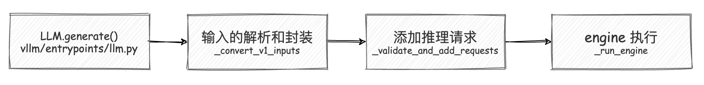

# vLLM 调度前的预处理工作

上一篇文章中我们介绍了 vLLM 的代码架构，我们提到 vLLM 有一个调度器模块，它负责决定每个推理阶段的任务调度。调度器主要负责选择哪些数据需要送到模型去推理，其中也实现了连续批处理的功能。在这篇文章中，我们先介绍一下调度前的准备工作，主要是输入的预处理以及把输入合并成 SequenceGroup 的过程。

在下一篇文章中，我们会介绍调度预算（SchedulingBudget）是如何影响任务的分配决策的，调度器如何将多个任务批量发送到 GPU 执行，如何处理优先级高的任务？调度器如何决定抢占低优先级任务等。


:::note

本系列的代码基于 vLLM 的 0.6.3 版本介绍

:::

## 1. 调用 vLLM 推理的小 demo

首先让我们从一个小 demo 作为切入口然后逐步深入 vLLM 调度器的源码实现。

```python
from vllm import LLM, SamplingParams

prompts = [
    "Hello, my name is",
    "The president of the United States is",
    "The capital of France is",
    "The future of AI is",
]
sampling_params = SamplingParams(temperature=0.8, top_p=0.95)

llm = LLM(model='meta-llama/Llama-2-7b-hf')

outputs = llm.generate(prompts, sampling_params)

# Print the outputs.
for output in outputs:
    prompt = output.prompt
    generated_text = output.outputs[0].text
    print(f"Prompt: {prompt!r}, Generated text: {generated_text!r}")
```

在这个 demo 中，我们首先创建了一个 LLM 对象，然后定义了一些 prompts 和采样参数。接着，我们调用 `llm.generate()` 方法来执行推理任务，最后打印输出结果。

由此可以窥见所有的推理请求都是通过 `llm.generate()` ，下面我们开始剖析这个方法的内部实现。

## 2. 推理请求的输入与任务创建

在 vLLM 中，`LLM.generate()` 方法是用户与模型进行交互的核心入口。这个方法通过一系列精心设计的步骤，将用户提供的 prompts 转换为推理任务，并通过调度器有效执行这些任务。

当你调用 `LLM.generate()` 方法时，vLLM 会处理你提供的 prompts 和采样参数，将它们转化为可供推理执行的任务。这个方法的目标是将你的输入（无论是单个 prompt 还是多个 prompts）封装为系统可以识别的对象，然后通过智能的**批处理机制来**提高推理效率。

```python 
outputs = llm.generate(prompts, sampling_params)
```

上面这行代码简单地调用了 `generate()` 方法，但在内部却有一系列复杂的步骤。首先，prompts 是你提供的输入文本，sampling_params 控制模型生成文本时的行为，比如温度（temperature）和采样概率（top_p）。接下来，`generate()` 方法会逐步处理这些输入，首先将 prompts 转换为可以理解的格式，然后调用 LLM 引擎来执行推理任务。



### 2.1 输入的解析与封装

在 `generate()` 方法内部，第一步是处理用户提供的 prompts。prompts 的格式可能有多种：它可以是单个字符串（即一个 prompt），也可以是一个包含多个字符串的列表（多个 prompts）。此外，用户还可以选择直接传入 `token ids`，而不是文本。为了处理这种多样化的输入，`generate()` 会根据不同情况来处理输入，确保所有的输入最终都转化为统一的格式。

```python
parsed_prompts = self._convert_v1_inputs(
    prompts=cast(Optional[Union[str, List[str]]], prompts),
    prompt_token_ids=prompt_token_ids,
)
```

在这里，`_convert_v1_inputs()` 方法会将 prompts 转换为 TextPrompt 或 TokensPrompt 对象。这一步的作用是保证后续的处理统一使用标准化的数据格式。 parsed_prompts 的类型是 `List[PromptType]`。 `PromptType` 可以直接理解为一个字典，它包含了 prompt 的文本、token ids 等信息。


### 2.2 任务的验证与创建

在将输入解析为标准格式之后，`generate()` 方法会调用 `_validate_and_add_requests()` 方法来验证并添加推理请求。

在 `_validate_and_add_requests()` 方法内部，系统会为每一个 prompt 创建一个请求对象，并将这些请求传递给 LLM engine。在这个过程中，系统会检查每个请求的参数，确保它们与模型的要求相符。比如，如果用户提供了多个 prompts，那么相应的采样参数也需要是多个，且数量必须与 prompts 一一对应。如果两者不匹配，系统会抛出错误，提示用户调整输入。

接下来，`_validate_and_add_requests()` 会调用 `_add_request()` 方法，真正将每个请求添加到引擎中。每个请求都会被分配一个唯一的 request_id，这使得系统能够跟踪每个任务的执行情况。

```python
def _add_request(
    self,
    prompt: PromptType,
    params: Union[SamplingParams, PoolingParams],
    lora_request: Optional[LoRARequest] = None,
    prompt_adapter_request: Optional[PromptAdapterRequest] = None,
    priority: int = 0,
) -> None:
    request_id = str(next(self.request_counter))
    self.llm_engine.add_request(
        request_id,
        prompt,
        params,
        lora_request=lora_request,
        prompt_adapter_request=prompt_adapter_request,
        priority=priority,
    )
```

`_add_request()` 的作用是将封装好的 prompt 和 params（包括用户的采样参数）添加到 LLM 引擎中。

### 2.3 引擎执行与结果返回

当所有的请求都添加完毕后，系统会调用 `_run_engine()` 方法，开始实际的推理任务。这个方法通过 LLM 引擎逐步执行每个请求，并不断检查任务的状态，直到所有的任务都执行完毕。

```python
outputs = self._run_engine(use_tqdm=use_tqdm)
```

在 `_run_engine()` 中，系统会通过引擎的 `step()` 方法来逐步处理请求。每一步都会检查是否有任务已经完成，并将完成的任务结果添加到输出列表中。

```python 
def _run_engine(
        self, *, use_tqdm: bool
) -> List[Union[RequestOutput, EmbeddingRequestOutput]]:
    # Initialize tqdm.
    if use_tqdm:
        num_requests = self.llm_engine.get_num_unfinished_requests()
        pbar = tqdm(
            total=num_requests,
            desc="Processed prompts",
            dynamic_ncols=True,
            postfix=(f"est. speed input: {0:.2f} toks/s, "
                        f"output: {0:.2f} toks/s"),
        )

    # Run the engine.
    outputs: List[Union[RequestOutput, EmbeddingRequestOutput]] = []
    total_in_toks = 0
    total_out_toks = 0
    while self.llm_engine.has_unfinished_requests():
        step_outputs = self.llm_engine.step()
        for output in step_outputs:
            if output.finished:
                outputs.append(output)
                if use_tqdm:
                    if isinstance(output, RequestOutput):
                        # 在处理过程中，更新进度条并计算输入和输出的token速度。
                        assert output.prompt_token_ids is not None
                        total_in_toks += len(output.prompt_token_ids)
                        in_spd = total_in_toks / pbar.format_dict["elapsed"]
                        total_out_toks += sum(
                            len(stp.token_ids) for stp in output.outputs)
                        out_spd = (total_out_toks /
                                    pbar.format_dict["elapsed"])
                        pbar.postfix = (
                            f"est. speed input: {in_spd:.2f} toks/s, "
                            f"output: {out_spd:.2f} toks/s")
                    pbar.update(1)

    if use_tqdm:
        pbar.close()
    # Sort the outputs by request ID.
    # This is necessary because some requests may be finished earlier than
    # its previous requests.
    return sorted(outputs, key=lambda x: int(x.request_id))
```

可以看到，`_run_engine()` 方法会不断调用引擎的 `step()` 方法，直到所有的请求都完成。在每一步中，系统会检查是否有任务已经完成，如果有，就将结果添加到输出列表中。最后，系统会返回所有的输出结果。

:::tip

我们可以注意到，在处理过程中，系统会不断更新进度条，并计算输入和输出的 token 速度。如果我们想要自己添加一些额外的处理逻辑，可以在这里进行扩展。

:::

## 3. 输入数据的预处理

在前一部分中，我们讨论了 `LLM` 类中 `add_request` 方法的结构和功能，我们可以注意到，其中的关键步骤就是 `self.llm_engine.add_request`，这个方法会将用户的请求添加到引擎中，然后引擎会负责处理这些请求。

接下来我们将深入分析 `LLMEngine` 的请求处理流程。通过 `LLMEngine.add_request` 方法接收到的请求会经过一系列预处理、调度、执行和输出处理步骤。

**`LLMEngine` 的核心功能之一是处理用户请求，而这个请求处理过程的起点是 `add_request` 方法。**

### 3.1 add_request 参数解析

```python
def add_request(
    self,
    request_id: str,
    prompt: PromptType,
    params: Union[SamplingParams, PoolingParams],
    arrival_time: Optional[float] = None,
    lora_request: Optional[LoRARequest] = None,
    trace_headers: Optional[Mapping[str, str]] = None,
    prompt_adapter_request: Optional[PromptAdapterRequest] = None,
    priority: int = 0,
    *,
    inputs: Optional[PromptType] = None,  # DEPRECATED
) -> None:
```

参数解析与检查:

首先，add_request 方法接受了多个参数，其中关键的参数包括：

- `request_id`：每个请求的唯一标识符，用于跟踪和调度。
- `prompt`：请求的提示词，通常是用户输入的自然语言文本，定义了生成任务的起点。
- `params`：这是生成任务的参数，可能是 `SamplingParams`（采样生成参数）或者 `PoolingParams`（池化生成参数），这将影响生成的策略，比如温度、采样方法等。

### 3.2 预处理入口

在 `LLMEngine` 中，当我们使用 `add_request` 方法添加一个请求时，系统首先会调用 `InputPreprocessor` 对输入进行预处理，这一过程确保用户的输入被模型正确处理。`InputPreprocessor` 类负责解析和处理不同类型的输入（包括文本、tokens 等），并将其转换为模型可以使用的标准化格式。

**`InputPreprocessor` 中的 `preprocess` 方法是整个输入预处理的入口。**根据模型的不同配置，输入的预处理过程可能会有所不同，主要取决于模型是 `encoder-decoder` 模型还是 `decoder-only` 模型。

```python
def preprocess(
    self,
    prompt: PromptType,  # 用户输入的 prompt，可以是文本、token 列表等多种形式
    request_id: str,  # 请求的唯一 ID，用于标识和追踪请求
    lora_request: Optional[LoRARequest] = None,  # 可选的 LoRA 配置
    prompt_adapter_request: Optional[PromptAdapterRequest] = None,  # 可选的 prompt 适配器配置
) -> Union[LLMInputs, EncoderDecoderLLMInputs]:
    """预处理输入的主方法。"""
    
    # 判断当前模型是否是 encoder-decoder 模型
    if self.is_encoder_decoder_model():
        # 如果是 encoder-decoder 模型，则需要将输入映射到 encoder 和 decoder
        return self._process_encoder_decoder_prompt(
            prompt,
            request_id=request_id,
        )

    # 检查输入是否包含显式的 encoder-decoder prompt，如果是 decoder-only 模型，则抛出异常
    if is_explicit_encoder_decoder_prompt(prompt):
        raise ValueError("不能将 encoder-decoder prompt 传递给 decoder-only 模型")

    # 对于 decoder-only 模型，直接处理 decoder 的输入
    return self._process_decoder_only_prompt(
        prompt,
        request_id=request_id,
        lora_request=lora_request,
        prompt_adapter_request=prompt_adapter_request,
    )
```

对于 `encoder-decoder` 模型，输入需要分为 encoder prompt 和 decoder prompt，每一部分都需要分别进行处理。`_process_encoder_decoder_prompt` 是专门为 encoder-decoder 模型设计的，它能够处理同时包含编码器和解码器的 prompt。

现在我们只考虑 decoder-only 模型，对于 decoder-only 模型，输入处理相对简单，仅需要处理单一的解码器 prompt。`_process_decoder_only_prompt` 的逻辑如下：


```python
def _process_decoder_only_prompt(
    self,
    prompt: SingletonPrompt,  # 输入的解码器 prompt
    request_id: str,  # 请求 ID
    lora_request: Optional[LoRARequest] = None,  # 可选的 LoRA 请求
    prompt_adapter_request: Optional[PromptAdapterRequest] = None,  # 可选的 prompt 适配器
) -> LLMInputs:
    '''
    对于 decoder-only 模型，处理输入 prompt 并生成 LLMInputs。
    '''

    # Step1: 提取 prompt 的组成部分，包括 token ids 和多模态数据
    prompt_comps = self._extract_prompt_components(
        prompt,
        request_id=request_id,
        lora_request=lora_request,
    )

    # Step2: 生成 LLMInputs 对象，包含处理后的 prompt token ids 和可能存在的多模态数据
    return self._build_decoder_only_llm_inputs(
        prompt_comps,
        prompt_adapter_request=prompt_adapter_request,
    )
```

`_extract_prompt_components` 方法负责提取其组成部分（例如：token ids，文本等），详细介绍见注释：


```python
def _extract_prompt_components(
    self,
    prompt: SingletonPrompt,  # 单一的 encoder 或 decoder prompt
    request_id: str,  # 请求 ID
    lora_request: Optional[LoRARequest] = None,
) -> PromptComponents:
    '''
    提取单一的 encoder 或 decoder 输入的组成部分。
    '''

    # 解析输入，判断它是文本、token 列表或多模态数据
    parsed = parse_singleton_prompt(prompt)

    if parsed["type"] == "str":
        # 如果输入是纯文本，则进行分词，得到 token ids
        prompt_text = parsed["content"]
        prompt_token_ids = self._tokenize_prompt(
            prompt_text,
            request_id=request_id,
            lora_request=lora_request,
        )
        multi_modal_data = None  # 文本没有多模态数据
    elif parsed["type"] == "tokens":
        # 如果输入是 token 列表，则直接提取 token ids
        prompt_text = None
        prompt_token_ids = parsed["content"]["prompt_token_ids"]
        multi_modal_data = parsed["content"].get("multi_modal_data")  # 可能包含多模态数据
    elif parsed["type"] == "text":
        # 另一种文本格式，提取 prompt 并进行分词
        prompt_text = parsed["content"]["prompt"]
        prompt_token_ids = self._tokenize_prompt(
            prompt_text,
            request_id=request_id,
            lora_request=lora_request,
        )
        multi_modal_data = parsed["content"].get("multi_modal_data")  # 检查是否有多模态数据
    else:
        assert_never(parsed)  # 对于未知类型，抛出异常

    return prompt_text, prompt_token_ids, multi_modal_data  # 返回提取的 prompt 组成部分
```

分词器（tokenizer）负责将文本形式的 prompt 转换为 token 序列，供模型使用。分词逻辑主要在 `_tokenize_prompt` 方法中完成：


```python
def _tokenize_prompt(
    self,
    prompt: str,  # 要进行分词的文本
    request_id: str,  # 请求 ID
    lora_request: Optional[LoRARequest],  # 可选的 LoRA 请求
) -> List[int]:
    """
    使用模型的分词器对文本进行分词，返回对应的 token IDs。
    """

    # 获取当前模型的分词器组
    tokenizer = self.get_tokenizer_group()

    # 对文本进行编码，得到 token IDs
    return tokenizer.encode(request_id=request_id,
                            prompt=prompt,
                            lora_request=lora_request)
```


### 3.3 创建 Sequence 和 SequenceGroup

在输入预处理完成后，`_add_processed_request` 中会将处理后的输入转换为 `Sequence` 或 `SequenceGroup` 对象。

:::note

Sequence 是用于管理单个请求的对象，它 ____ ?

`Sequence` 是对每一个请求输入的具体表示，包含了输入的 `token` 序列、解码器状态（如 KV 缓存）等信息。

:::


我们从 `_add_processed_request` 方法中，可以看到 `Sequence` 的构建逻辑：

```python
def _add_processed_request(
    self,
    request_id: str,  # 请求的唯一 ID
    processed_inputs: Union[LLMInputs, EncoderDecoderLLMInputs],  # 预处理后的输入
    params: Union[SamplingParams, PoolingParams],  # 采样或池化参数
    arrival_time: float,  # 请求到达时间
    lora_request: Optional[LoRARequest],  # 可选的 LoRA 请求
    prompt_adapter_request: Optional[PromptAdapterRequest],  # 可选的 Prompt 适配器请求
    trace_headers: Optional[Mapping[str, str]] = None,  # 跟踪请求头
    priority: int = 0,  # 请求优先级
) -> None:
    # 验证模型输入是否有效
    self._validate_model_inputs(processed_inputs)

    # 创建序列
    block_size = self.cache_config.block_size  # 获取 block 大小，用于缓存
    seq_id = next(self.seq_counter)  # 为序列生成一个唯一的 ID
    eos_token_id = self.input_preprocessor.get_eos_token_id(lora_request)  # 获取 EOS token 的 ID
    
    # 使用上面的信息初始化 Sequence 对象
    seq = Sequence(
        seq_id,  # 序列 ID
        processed_inputs,  # 预处理后的输入数据
        block_size,  # 缓存 block 大小
        eos_token_id,  # 结束 token 的 ID
        lora_request,  # 可选的 LoRA 请求
        prompt_adapter_request  # 可选的 Prompt 适配器请求
    )

    # 如果是 encoder-decoder 模型，还需要处理编码器序列
    ... # 省略 encoder-decoder 模型的处理逻辑
    
    # 序列组的创建将在后续步骤中进行
```

`SequenceGroup` 表示的是多个 `Sequence` 的集合，通常是因为这些 `Sequence` 共享相同的采样参数（如温度、采样策略等）以及优先级调度策略（如 priority）。`SequenceGroup` 的创建是通过 `_create_sequence_group_with_sampling` 或 `_create_sequence_group_with_pooling` 方法完成的，具体取决于是否采用采样策略或者池化策略。

这里我们以采样策略为例，看一下 `_create_sequence_group_with_sampling` 方法。

:::note

SamplingParams 的作用是什么？

`SamplingParams` 是用于控制模型生成文本时的行为的参数，比如温度（temperature）、采样概率（top_p）等。`SamplingParams` 会影响生成的策略，比如生成的多样性、生成的质量等。

:::

```python
# vllm/engine/llm_engine.py
def _create_sequence_group_with_sampling(
    self,
    request_id: str,  # 请求的唯一 ID
    seq: Sequence,  # 需要添加到序列组的 Sequence 对象
    sampling_params: SamplingParams,  # 采样参数，控制生成策略
    arrival_time: float,  # 请求到达时间
    ... # 其他参数
) -> SequenceGroup:
    """使用 SamplingParams 创建一个 SequenceGroup。"""
    
    # 获取模型配置中的最大 logprobs 值
    max_logprobs = self.get_model_config().max_logprobs
    
    # 检查采样参数中的 logprobs 和 prompt_logprobs 是否超过最大值
    if (sampling_params.logprobs
            and sampling_params.logprobs > max_logprobs) or (
                sampling_params.prompt_logprobs
                and sampling_params.prompt_logprobs > max_logprobs):
        raise ValueError(f"不能请求超过 {max_logprobs} 的 logprobs。")

    # 构建 logits 处理器
    sampling_params = self._build_logits_processors(
        sampling_params, lora_request)

    sampling_params = sampling_params.clone()

    # 从生成配置中更新采样参数
    sampling_params.update_from_generation_config(
        self.generation_config_fields, seq.eos_token_id)

    # 创建序列组
    seq_group = SequenceGroup(
        request_id=request_id,  # 请求 ID
        seqs=[seq],  # 包含的序列列表
        arrival_time=arrival_time,  # 请求到达时间
        sampling_params=sampling_params,  # 采样参数
        ...
        priority=priority)  # 请求优先级

    return seq_group
```

### 3.4 深入理解 SequenceGroup

:::tip

本小节参考了很多 [1] 中的内容, 感谢作者的分享。

:::

SequenceGroup 就是一个“1 个 prompt -> 多个 outputs”的容器。它包含一组“prompt -> output”的序列（我们称之为 seq，每个 seq 其实就是一个 Sequence 实例），每个 seq 会在推理过程中经历不同的状态（status）。这些状态为调度器提供了关键信息，让 vLLM 知道每个 seq 在什么时候、什么情况下应该做什么。

:::note

在 vLLM 中有一个重要假设：同一个 SequenceGroup 中的所有 seq 共享同一个 prompt。换句话说，一个 prompt 会生成多个不同的 outputs，但它们都来自同一个来源。

:::

在自然语言处理任务中，经常需要一个 prompt 生成多个不同的 outputs。例如，给定一个问题，我们可能想要生成多个回答，或者在文本生成中提供不同的句子结尾。这种需求是因为：

- 多样性：我们想要看到不同的可能输出，以便选择最适合的。
- 批量推理：在实际应用中，为了提高效率，我们往往批量生成多个候选输出，这样可以一次满足多个需求。

于是，SequenceGroup 就是一个用于管理“一次 prompt 生成多个 outputs” 的容器。它能够把多个生成任务（seq）打包在一起，从而让系统知道这些 seq 是由同一个 prompt 产生的。

此外 SequenceGroup 还有帮助调度器灵活控制任务的计算状态的作用。在大规模推理时，GPU 资源可能会不足，尤其是当任务量大、生成输出的数量多时。如果 GPU 内存不够用，系统就得灵活管理这些计算资源——也就是“抢占”（preemption）机制。

如果资源不足，SequenceGroup 中的所有 seq 可以一起被“swap out”到 CPU 中，等资源充足时再一起“swap in”，恢复计算。 换句话说，SequenceGroup 帮助系统“打包”了同一个 prompt 生成的多个 outputs，便于调度器做成批管理，而不是一个个零散管理。这样既避免了大量的小任务在内存中频繁进出，又可以在有资源时迅速恢复计算，提高了 GPU 利用率。

到此，输入的预处理工作就完成了，我们成功的将用户的请求转换为了 `SequenceGroup` 对象，`SequenceGroup` 对象包含了多个 `Sequence` 对象，且存储了用户请求的信息，包括请求的唯一 ID、请求的到达时间、采样参数等。


## 4. 总结

在这篇文章中，我们深入分析了 vLLM 的输入预处理过程，包括用户请求的解析、分词、序列和序列组的创建。我们了解到 vLLM 的输入预处理是一个复杂的过程，需要处理多种类型的输入，并将其转换为模型可以理解的标准化格式。在下一篇文章中，我们将继续深入研究 vLLM 的调度器模块，探讨任务的调度和执行过程，以及如何高效地管理和处理多个请求。

## 参考文献

1. https://zhuanlan.zhihu.com/p/692540949
2. https://arxiv.org/pdf/2309.06180