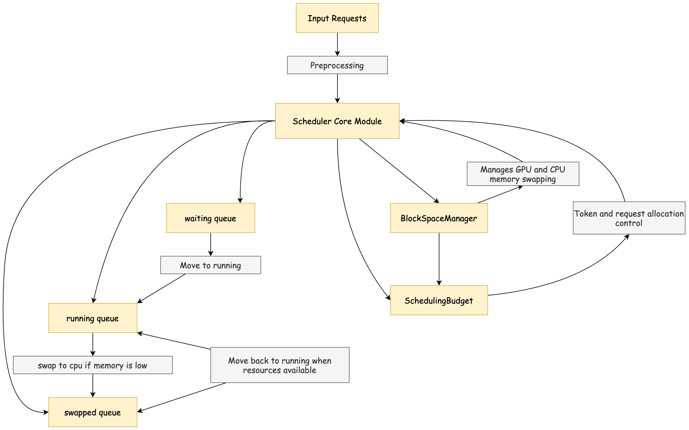

# vLLM 调度器策略

上一篇文章中我们介绍了 vLLM 调度器的预处理工作，我们已经知道了在进行调度之前，数据会被预处理然后用 SequenceGroup 对象进行封装。在这篇文章中，我们将会介绍 vLLM 调度器的具体调度策略。

:::note

本系列的代码基于 vLLM 的 0.6.3 版本介绍

:::

vLLM 调度器是一个专为优化生成式模型而设计的调度器。与普通的任务调度器相比，它**不仅要管理多个请求的排队和处理，还要动态分配 GPU 和 CPU 内存、控制数据的加载与交换，确保系统在不同负载下均能高效运行**。

本文将通过详细的源码解析，逐步带领读者深入理解 vLLM 调度器的设计与实现。我们将**从基础概念、核心组件、调度策略以及资源管理等多方面展开，通过实例和源码逐步揭示调度器如何在实际应用中高效管理请求**。


## 1. 基础概念与背景

### 1.1 调度的定义与作用

在生成式模型的运行过程中，调度器的核心任务是高效地管理资源（主要是 GPU 和 CPU 内存）和控制请求的执行顺序。生成式模型通常需要处理多个并发请求，特别是在大规模部署环境中，这些请求可能来自不同的用户或任务，并且拥有不同的处理需求和优先级。

vLLM 调度器的设计旨在优化多任务环境中的 GPU 和 CPU 资源利用率。调度器通过以下几种机制来实现该目标：

1. **优先级调度**：为请求分配不同的优先级，确保关键任务或延迟敏感任务优先处理。
2. **资源预算控制**：定义了每一轮调度中允许的最大内存消耗和任务数量，以防止资源过载。
3. **抢占策略**：当高优先级请求进入系统而资源不足时，调度器可以选择暂停或中止低优先级任务来腾出资源。

### 1.2 请求类型：预填充和解码

vLLM 调度器主要处理两种类型的请求：

1. 预填充（Prefill）：指生成请求的初始阶段，其中模型需要处理用户输入并生成初始的上下文嵌入。预填充任务通常包含较大的计算量，因为它涉及模型权重和输入数据的第一次计算。
2. 解码（Decode）：在初始的预填充阶段完成后，解码任务会根据预填充的上下文生成实际的输出。这一过程包含模型的逐步推理，生成新单词或 token。解码任务通常是增量计算，因为每个步骤的生成都基于前一步的结果。

调度器会根据请求类型的不同，将它们放置在相应的队列中并进行优先级控制。通过对这两种请求进行分离处理，调度器可以更好地管理模型的生成过程。

### 1.3 优先级调度

在多任务环境中，调度器为每个请求分配优先级。在 vLLM 中，优先级主要由任务的重要性和到达时间决定。优先级调度确保高优先级的任务不被低优先级的任务阻塞，以便资源分配更加合理。

```python
def _get_priority(self, seq_group: SequenceGroup) -> Tuple[Optional[int], float]:
    """ 获取 SequenceGroup 的优先级：首先根据用户定义的优先级值，其次按到达时间排序。 """
    return seq_group.priority, seq_group.arrival_time
```

上面的代码段展示了调度器如何获取 SequenceGroup 的优先级：首先考虑用户指定的优先级值，其次按照到达时间排序。这一逻辑帮助调度器将高优先级任务快速安排到合适的计算队列中。

### 1.4 预算控制

预算控制是指调度器通过设定的预算（如内存或 token 数量），在每次调度中控制并发请求的数量，防止资源过载。在 vLLM 中，SchedulingBudget 类定义了预算，包括 token_budget（token 数量上限）和 max_num_seqs（请求数量上限）。

```python
@dataclass
class SchedulingBudget:
    """ 调度预算的定义，控制 token 和并发请求的数量上限。 """
    token_budget: int  # token 总预算
    max_num_seqs: int  # 最大序列数
    # 内部状态
    _num_batched_tokens: int = 0
    _num_curr_seqs: int = 0

    def can_schedule(self, *, num_new_tokens: int, num_new_seqs: int):
        """ 判断是否可以调度新的 token 和请求数。 """
        return (self.num_batched_tokens + num_new_tokens <= self.token_budget
                and self.num_curr_seqs + num_new_seqs <= self.max_num_seqs)
```

在 `SchedulingBudget` 中，调度器会实时检查 token_budget 和 max_num_seqs 是否达到了上限。通过控制这些预算，可以避免单次调度中消耗过多资源，确保模型的稳定运行。

### 1.5 抢占策略

**当资源不足且有高优先级请求进入系统时，调度器会采取抢占策略。抢占机制允许调度器将低优先级任务暂停或中止，以释放资源给高优先级任务**。调度器通过 `_preempt` 函数执行抢占操作，并根据具体的策略选择是重新计算还是将任务交换到 CPU 内存。

```python
def _preempt(self, seq_group: SequenceGroup, blocks_to_swap_out: List[Tuple[int, int]], preemption_mode: Optional[PreemptionMode] = None):
    """ 当资源不足时执行抢占，选择 SWAP 或 RECOMPUTE 模式释放内存资源。 """
    if preemption_mode == PreemptionMode.RECOMPUTE:
        self._preempt_by_recompute(seq_group)
    elif preemption_mode == PreemptionMode.SWAP:
        self._preempt_by_swap(seq_group, blocks_to_swap_out)
```

调度器根据抢占模式（RECOMPUTE 或 SWAP）执行不同的抢占策略。RECOMPUTE 模式会释放资源并标记任务为“等待重计算”，而 SWAP 模式则会将任务的数据交换到 CPU 内存以释放 GPU 资源。这些策略确保了调度器在高负载场景下依然能够有效响应优先级较高的请求。

## 2. 调度器的结构与主要组件

在 vLLM 中，调度器的结构设计围绕任务的状态管理和内存资源的优化利用展开。为此，它将任务划分为不同的状态队列，并通过缓存管理和内存调度来保证任务处理的高效性。下面详细介绍调度器的核心组成部分：waiting、running 和 swapped 三个状态队列的作用及设计。

  


### 2.1 核心状态队列设计

vLLM 调度器依赖三个状态队列来管理任务的不同阶段：

1. **waiting 队列**：waiting 队列用于存放新加入的任务或已完成预填充阶段但等待解码的任务。调度器会从 waiting 队列中取出任务，判断其是否可以分配资源，如果资源允许，则将其移至 running 队列。
2. **running 队列**：running 队列包含当前正在处理的任务，通常是在解码阶段。调度器会根据当前资源情况和任务优先级，决定是否抢占任务，将其暂时移出 GPU 以腾出资源。抢占的任务会被转移到 swapped 队列中。
3. **swapped 队列**：swapped 队列用于存放因资源不足而被暂时从 GPU 移至 CPU 的任务。调度器会定期检查 swapped 队列，如果资源允许，则将任务重新加载到 GPU，继续运行。

调度器的核心代码如下：

```python
class Scheduler:

    def __init__(self, scheduler_config: SchedulerConfig, cache_config: CacheConfig, ...):
        # waiting 队列：包含等待执行的 SequenceGroup
        self.waiting: Deque[SequenceGroup] = deque()
        # running 队列：包含正在执行的 SequenceGroup
        self.running: Deque[SequenceGroup] = deque()
        # swapped 队列：包含已从 GPU 移出的 SequenceGroup
        self.swapped: Deque[SequenceGroup] = deque()
```

`Scheduler` 的 `__init__` 初始化方法定义了这三个队列，确保任务在不同状态之间可以灵活调度。同时，通过 deque 数据结构实现队列操作，使得调度器能够高效地进行任务插入、删除和调度。

### 2.2 缓存与内存管理

在生成模型任务中，内存资源的有效利用非常关键。为此，vLLM 调度器通过 `SchedulingBudget` 和 `BlockSpaceManager` 两个组件来控制内存分配。

- SchedulingBudget：负责跟踪和限制任务使用的总 token 数和并发任务数。
- BlockSpaceManager：实际分配和管理 GPU/CPU 的内存块，处理 GPU 到 CPU 的内存交换。

`SchedulingBudget` 是一种资源预算控制器，管理任务使用的 token 和并发数。它设定了调度器的资源上限，帮助调度器判断是否可以接纳新任务。

以下是 SchedulingBudget 的实现片段：

```python
@dataclass
class SchedulingBudget:
    token_budget: int  # token 总预算
    max_num_seqs: int  # 最大任务数
    _num_batched_tokens: int = 0  # 当前已用 token 数
    _num_curr_seqs: int = 0  # 当前已用任务数

    def can_schedule(self, *, num_new_tokens: int, num_new_seqs: int) -> bool:
        # 判断当前预算是否允许新任务的调度
        return (self._num_batched_tokens + num_new_tokens <= self.token_budget and
                self._num_curr_seqs + num_new_seqs <= self.max_num_seqs)
```

通过 `SchedulingBudget`，调度器可以精确控制系统资源使用量，避免任务调度时超过内存上限。

相较于 `SchedulingBudget` 的资源控制，`BlockSpaceManager` 负责实际的 GPU/CPU 内存块分配。它提供内存管理和内存交换机制，在 GPU 与 CPU 之间高效转移任务数据。

在任务抢占时，调度器会调用 `BlockSpaceManager` 的交换功能，将部分任务数据从 GPU 内存转移至 CPU 缓存，释放 GPU 空间以便分配给其他任务。

例如，调度器在 `_preempt` 方法中，通过 `BlockSpaceManager` 来执行任务的内存交换：

```python
def _preempt(self, seq_group: SequenceGroup, blocks_to_swap_out: List[Tuple[int, int]], preemption_mode: Optional[PreemptionMode] = None) -> PreemptionMode:
    if preemption_mode == PreemptionMode.SWAP:
        self._preempt_by_swap(seq_group, blocks_to_swap_out)
    elif preemption_mode == PreemptionMode.RECOMPUTE:
        self._preempt_by_recompute(seq_group)
    return preemption_mode

def _preempt_by_swap(self, seq_group: SequenceGroup, blocks_to_swap_out: List[Tuple[int, int]]) -> None:
    # 使用 BlockSpaceManager 实现内存交换
    self._swap_out(seq_group, blocks_to_swap_out)

def _swap_out(self, seq_group: SequenceGroup, blocks_to_swap_out: List[Tuple[int, int]]) -> None:
    # 执行实际内存交换，将 GPU 资源转移到 CPU
    mapping = self.block_manager.swap_out(seq_group)
    blocks_to_swap_out.extend(mapping)
```

通过 `SchedulingBudget` 和 `BlockSpaceManager` 的配合，调度器不仅实现了对内存资源的精确控制，还通过高效的内存管理策略确保了系统的运行稳定性和任务执行效率。

## 3. 初始化与请求队列的管理

### 3.1 Scheduler 的初始化过程

Scheduler 的初始化过程集中在解析配置项、创建 `BlockSpaceManager` 和初始化状态队列，以确保调度器能够动态、高效地管理多任务请求。初始化过程中涉及三个主要配置：

- **scheduler_config**：包含调度器行为相关的设置，如任务优先级、调度策略等。
- **cache_config**：定义内存分配策略、GPU 与 CPU 缓存的使用等。
- **lora_config（可选）**：用于配置 LoRA 模型的特定要求，如并行度和内存需求。


```python
class Scheduler:
    def __init__(
        self,
        scheduler_config: SchedulerConfig,
        cache_config: CacheConfig,
        lora_config: Optional[LoRAConfig] = None,
        pipeline_parallel_size: int = 1,
        output_proc_callback: Optional[Callable] = None,
    ) -> None:
        self.scheduler_config = scheduler_config
        self.cache_config = cache_config
        self.lora_config = lora_config

        # 根据版本及配置选用不同的 BlockSpaceManager
        version = "selfattn" if not (scheduler_config.task == "embedding" or cache_config.is_attention_free) else "placeholder"
        BlockSpaceManagerImpl = BlockSpaceManager.get_block_space_manager_class(version)
        
        # 配置 GPU 和 CPU 块的数量
        num_gpu_blocks = cache_config.num_gpu_blocks // pipeline_parallel_size
        num_cpu_blocks = cache_config.num_cpu_blocks // pipeline_parallel_size
        
        # 初始化 BlockSpaceManager 以管理内存块
        self.block_manager = BlockSpaceManagerImpl(
            block_size=cache_config.block_size,
            num_gpu_blocks=num_gpu_blocks,
            num_cpu_blocks=num_cpu_blocks,
            sliding_window=cache_config.sliding_window,
            enable_caching=cache_config.enable_prefix_caching
        )
        
        # 初始化请求的状态队列
        self.waiting: Deque[SequenceGroup] = deque()
        self.running: Deque[SequenceGroup] = deque()
        self.swapped: Deque[SequenceGroup] = deque()
        
        # 用于记录完成请求的 ID
        self._finished_requests_ids: List[str] = []
        self.output_proc_callback = output_proc_callback
        self.cache_id = 0
        self._async_stopped: List[SequenceGroup] = []
```

### 3.2 请求的预处理：解析并构建 SequenceGroup

上一篇文章中我们已经介绍了 vLLM 调度器的预处理工作，这里我们再带一下。每个新请求在进入调度队列前需要被解析并转换成 `SequenceGroup` 实例。这一步骤的关键在于为请求分配适当的 token 数、调度优先级、资源需求等信息，然后将其分配至 `waiting`、`running` 或 `swapped` 队列。

- **SequenceGroup**：一个请求可能包含多个序列（如生成任务的多个解码路径）。SequenceGroup 用于管理请求的多个序列，并跟踪该组序列的状态。
- **add_seq_group** 方法：将一个新请求包装为 `SequenceGroup`，并添加到 waiting 队列。

一个新请求在进入调度器后，会首先经过 `add_seq_group` 的包装流程，生成 `SequenceGroup` 实例，并加入 waiting 队列。假设一个请求需要生成文本的多种可能性，调度器会解析该请求并通过 `add_seq_group` 将其加入等待队列，等待资源分配。

## 4. 调度流程与任务分配策略

在 `Scheduler` 中，调度器的主要调度逻辑在 `_schedule` 函数内，根据配置选择 `_schedule_default` 或 `_schedule_chunked_prefill` 来实现调度策略。本文重点介绍 _schedule_default，`_schedule_chunked_prefill` 后续我们会单独用一篇文章来介绍。以下内容将逐步解析 `_schedule_default` 方法及其调用的 `_schedule_prefills`、 `_schedule_running` 和 `_schedule_swapped` 方法的实现细节。

  

### 4.1 核心调度逻辑

`_schedule_default` 方法是默认调度流程的入口。它首先设置预算、预填充请求和当前运行的请求状态，然后根据 running 队列中已有的 token 和 curr_loras (当前 LoRA 请求) 更新预算。随后依次执行预填充、解码和交换等操作。

```python
def _schedule_default(self) -> SchedulerOutputs:
    """调度队列中的请求，执行默认调度策略"""

    # 初始化预算，设置 token 和 sequence 的最大使用量
    budget = SchedulingBudget(
        token_budget=self.scheduler_config.max_num_batched_tokens,
        max_num_seqs=self.scheduler_config.max_num_seqs,
    )

    # 根据现有的运行任务，更新预算使用情况
    for seq_group in self.running:
        budget.add_num_seqs(seq_group.request_id, seq_group.get_max_num_running_seqs())
    curr_loras = set(
        seq_group.lora_int_id for seq_group in self.running
        if seq_group.lora_int_id > 0) if self.lora_enabled else None

    # 初始化预填充、运行和交换状态的调度结果
    prefills = SchedulerPrefillOutputs.create_empty()
    running_scheduled = SchedulerRunningOutputs.create_empty()
    swapped_in = SchedulerSwappedInOutputs.create_empty()

    # 若无交换请求，优先处理预填充请求
    if not self.swapped:
        prefills = self._schedule_prefills(budget, curr_loras, enable_chunking=False)

    # 若配置了优先级调度策略，调用调度优先级抢占逻辑
    if len(prefills.seq_groups) == 0 and self.scheduler_config.policy == "priority":
        self._schedule_priority_preemption(budget)

    # 在没有预填充请求的情况下，执行解码调度
    if len(prefills.seq_groups) == 0:
        running_scheduled = self._schedule_running(budget, curr_loras, enable_chunking=False)

        # 若解码阶段无资源抢占，继续处理交换请求
        if len(running_scheduled.preempted) + len(running_scheduled.swapped_out) == 0:
            swapped_in = self._schedule_swapped(budget, curr_loras)

    # 更新 token 预算与当前 sequence 数量，确保预算不超出最大配置
    assert (budget.num_batched_tokens <= self.scheduler_config.max_num_batched_tokens)
    assert budget.num_curr_seqs <= self.scheduler_config.max_num_seqs

    # 汇总等待、运行和交换阶段的请求队列
    self.waiting.extendleft(running_scheduled.preempted)
    self.running.extend([s.seq_group for s in prefills.seq_groups])
    self.running.extend(running_scheduled.decode_seq_groups_list)
    if len(swapped_in.decode_seq_groups) > 0:
        self.running.extend([s.seq_group for s in swapped_in.decode_seq_groups])
    self.swapped.extend(running_scheduled.swapped_out)

    # 汇总调度结果，返回所有调度的 sequence 组
    scheduled_seq_groups = (prefills.seq_groups + running_scheduled.decode_seq_groups
                            + swapped_in.decode_seq_groups)
    return SchedulerOutputs(
        scheduled_seq_groups=scheduled_seq_groups,
        num_prefill_groups=len(prefills.seq_groups),
        num_batched_tokens=budget.num_batched_tokens,
        blocks_to_swap_in=swapped_in.blocks_to_swap_in,
        blocks_to_swap_out=running_scheduled.blocks_to_swap_out,
        blocks_to_copy=running_scheduled.blocks_to_copy,
        ignored_seq_groups=prefills.ignored_seq_groups + swapped_in.infeasible_seq_groups,
        num_lookahead_slots=running_scheduled.num_lookahead_slots,
        running_queue_size=len(self.running),
        preempted=(len(running_scheduled.preempted) + len(running_scheduled.swapped_out)),
    )
```

在 `_schedule_default` 方法中：

1. **初始化预算**：通过 SchedulingBudget 设定 token_budget 和 max_num_seqs，即最大 token 和 sequence 数量，确保调度过程不超出资源限制。
2. **更新预算和 LoRA 请求**：在 running 队列中的请求占用了预算，因此遍历 running 队列，将它们的 token 使用情况更新到预算中。
3. **预填充**：若无交换请求，将预填充请求从 waiting 队列转入 GPU，调用 `_schedule_prefills` 实现。
4. **优先级调度**：若有预填充请求，且配置了优先级调度策略，通过 self._schedule_priority_preemption(budget) 实现优先级抢占调度。
5. **解码**：调用 _schedule_running 将 running 队列中的请求进行解码处理。
交换请求：若解码阶段无抢占请求，则将交换队列中的请求加载至 GPU 内存中，调用 _schedule_swapped 实现。
6. **汇总调度结果**：收集各阶段调度的 seq_groups，统一汇总到 SchedulerOutputs。

### 4.2 预填充阶段

`_schedule_prefills` 方法用于将处于 waiting 队列中的请求转移到 running 队列。这一阶段确保请求在解码前被加载到 GPU 上，以便模型进行初始处理。`_schedule_prefills` 方法会根据资源预算、请求大小等条件判断哪些请求可以进入 GPU。以下是该方法的核心代码：

```python
def _schedule_prefills(self, budget: SchedulingBudget, curr_loras: Optional[Set[int]], enable_chunking: bool = False) -> SchedulerPrefillOutputs:
    # 初始化忽略的序列组列表和调度的序列组列表
    ignored_seq_groups: List[SequenceGroup] = []
    seq_groups: List[ScheduledSequenceGroup] = []

    # 等待队列中的请求逐个处理
    while self._passed_delay(time.time()) and self.waiting:
        seq_group = self.waiting[0]
        
        # 获取当前请求所需的 token 数量
        num_new_tokens = self._get_num_new_tokens(seq_group, SequenceStatus.WAITING, enable_chunking, budget)

        # 若请求的 token 数量超出限制，将其标记为忽略，移出等待队列
        if num_new_tokens > self._get_prompt_limit(seq_group):
            ignored_seq_groups.append(seq_group)
            self.waiting.popleft()
            continue

        # 检查分配条件，若未满足，退出循环等待下次机会
        can_allocate = self.block_manager.can_allocate(seq_group)
        if can_allocate == AllocStatus.LATER:
            break
        elif can_allocate == AllocStatus.NEVER:
            ignored_seq_groups.append(seq_group)
            self.waiting.popleft()
            continue

        # 允许的请求转移至运行中队列并更新预算
        self._allocate_and_set_running(seq_group)
        seq_groups.append(ScheduledSequenceGroup(seq_group=seq_group, token_chunk_size=num_new_tokens))
        budget.add_num_batched_tokens(seq_group.request_id, num_new_tokens)

    # 返回结果对象
    return SchedulerPrefillOutputs(
        seq_groups=seq_groups,
        ignored_seq_groups=ignored_seq_groups,
        num_lookahead_slots=self._get_num_lookahead_slots(is_prefill=True, enable_chunking=enable_chunking))
```


`_schedule_prefills` 首先通过 `_passed_delay` 检查当前时间是否达到可调度状态，以避免资源过度消耗。`_passed_delay` 方法基于 `delay_factor` 和 `last_prompt_latency` 来控制调度频率。如果 `delay_factor` 大于零，调度器会依据上一个请求的延迟时间来计算一个调度阈值，确保请求不会过于频繁地进入 GPU 进行处理。


:::note

模型在做推理时，waiting 队列中是源源不断有 seq_group 进来的，一旦 vLLM 选择调度 waiting 队列，它就会停下对 running/swapped 中 seq_group 的 decode 处理，转而去做 waiting 中 seq_group 的 prefill，也即**vLLM 必须在新来的 seq_group 和已经在做推理的 seq_group 间取得一种均衡：既不能完全不管新来的请求，也不能耽误正在做推理的请求**$^{[1]}$。 `_passed_delay` 就是用来做这个判断的。

:::

```python
def _passed_delay(self, now: float) -> bool:
    if self.prev_prompt:
        self.last_prompt_latency = now - self.prev_time
    self.prev_time, self.prev_prompt = now, False

    if self.scheduler_config.delay_factor > 0 and self.waiting:
        earliest_arrival_time = min([e.metrics.arrival_time for e in self.waiting])
        passed_delay = ((now - earliest_arrival_time) > 
                        (self.scheduler_config.delay_factor * self.last_prompt_latency)
                        or not self.running)
    else:
        passed_delay = True
    return passed_delay
```

`prev_prompt` 和 `prev_time` 用于记录上一个请求的执行时间，从而动态计算 `last_prompt_latency` 以调整调度速率。这种延迟控制机制可以防止过度调度，减少 GPU 负载。

当延迟条件满足时，`_schedule_prefills` 会获取 waiting 队列中第一个请求的 token 数量，并通过 `_get_num_new_tokens` 方法来确定这个请求所需的 token 数量。随后，该 token 数量与 `_get_prompt_limit` 限制值进行比较，以确保请求不会超出模型的最大 token 负载。

```python
num_new_tokens = self._get_num_new_tokens(seq_group, SequenceStatus.WAITING, enable_chunking, budget)
if num_new_tokens > self._get_prompt_limit(seq_group):
    ignored_seq_groups.append(seq_group)
    self.waiting.popleft()
    continue
```

`_get_prompt_limit` 基于当前模型的最大长度设置限制，以防止超大请求影响生成过程的稳定性。

在确认 token 数量可接受后，`_schedule_prefills` 调用 `can_allocate` 方法来检查 GPU 资源是否充足。`block_manager.can_allocate` 使用 `BlockSpaceManager` 的缓存和内存管理机制，确保请求在 GPU 上能被分配到足够的内存空间。

```python
can_allocate = self.block_manager.can_allocate(seq_group)
if can_allocate == AllocStatus.LATER:
    break
elif can_allocate == AllocStatus.NEVER:
    ignored_seq_groups.append(seq_group)
    self.waiting.popleft()
    continue
```

若 `can_allocate` 返回 `AllocStatus.LATER`，表明当前 GPU 资源不足，调度器将等待下次机会；若返回 `AllocStatus.NEVER`，则说明该请求太大无法分配，调度器将忽略该请求并将其移出等待队列。

对于满足所有条件的请求，调度器调用 `_allocate_and_set_running` 方法，将请求迁移到 running 队列，并为其分配所需资源。这一步使用 `block_manager.allocate` 来分配 GPU 资源，同时将请求的 status 更新为 RUNNING。

```python
def _allocate_and_set_running(self, seq_group: SequenceGroup) -> None:
    self.block_manager.allocate(seq_group)
    for seq in seq_group.get_seqs(status=SequenceStatus.WAITING):
        seq.status = SequenceStatus.RUNNING
```

`allocate` 函数通过 `block_manager` 的内存管理功能，为请求在 GPU 上分配所需的内存空间，从而确保其可以顺利进入解码阶段。

请求完成资源分配后，调度器会通过 `budget.add_num_batched_tokens` 更新当前的资源预算，以反映最新的资源占用情况。这一步确保预算控制在动态调度中能跟随请求变化，防止资源超分配。

```python
budget.add_num_batched_tokens(seq_group.request_id, num_new_tokens)
```

在 return 语句中，调度器会调用 `_get_num_lookahead_slots` 获取前瞻槽位（Lookahead Slots）数。对于多步调度和 Chunked prefill 启用的情况下，前瞻槽位数量会增加，从而确保未来的解码需求能够被预先分配到适当的内存资源。 `_get_num_lookahead_slots` 的返回值将作为调度结果的一部分，为后续解码阶段的任务分配做好准备。

### 4.3 解码阶段

在解码阶段，`_schedule_running` 方法负责处理 running 队列中的请求，具体包括对解码请求的资源分配、优先级处理以及潜在的抢占操作。这一步骤核心在于最大化地利用当前的 GPU 资源完成请求的解码，并通过抢占机制确保高优先级的请求能够及时得到处理。

以下是 _schedule_running 方法的代码及其详细解析：

```python
def _schedule_running(
    self,
    budget: SchedulingBudget,
    curr_loras: Optional[Set[int]],
    enable_chunking: bool = False,
) -> SchedulerRunningOutputs:
    # 初始化调度结果
    ret = self._scheduler_running_outputs_cache[self.cache_id].get_object()
    ret.blocks_to_swap_out.clear()
    ret.blocks_to_copy.clear()
    ret.decode_seq_groups.clear()
    ret.prefill_seq_groups.clear()
    ret.preempted.clear()
    ret.swapped_out.clear()

    # 计算当前步解码的预估槽位数
    ret.num_lookahead_slots = self._get_num_lookahead_slots(
        is_prefill=False, enable_chunking=enable_chunking
    )

    running_queue = self.running
    assert len(self._async_stopped) == 0

    # 遍历运行中的队列以调度解码请求
    while running_queue:
        seq_group = running_queue[0]
        num_running_tokens = self._get_num_new_tokens(
            seq_group, SequenceStatus.RUNNING, enable_chunking, budget
        )

        if num_running_tokens == 0:
            # 预算不足，结束调度
            break

        running_queue.popleft()

        if (
            self.use_async_output_proc
            and seq_group.seqs[0].get_len() > self.scheduler_config.max_model_len
        ):
            self._async_stopped.append(seq_group)
            continue

        # 检查是否有足够资源继续分配槽位
        while not self._can_append_slots(seq_group, enable_chunking):
            budget.subtract_num_batched_tokens(seq_group.request_id, num_running_tokens)
            num_running_seqs = seq_group.get_max_num_running_seqs()
            budget.subtract_num_seqs(seq_group.request_id, num_running_seqs)

            # 优先级抢占处理
            if running_queue:
                victim_seq_group = running_queue.pop()
            else:
                victim_seq_group = seq_group
                break

            if self.use_async_output_proc:
                self.output_proc_callback(request_id=victim_seq_group.request_id)
                if victim_seq_group.is_finished():
                    self._free_finished_seq_group(victim_seq_group)
                    continue

            preempted_mode = self._preempt(victim_seq_group, ret.blocks_to_swap_out)
            if preempted_mode == PreemptionMode.RECOMPUTE:
                ret.preempted.append(victim_seq_group)
            else:
                ret.swapped_out.append(victim_seq_group)

        # 更新调度结果
        self._append_slots(seq_group, ret.blocks_to_copy, enable_chunking)
        scheduled_seq_group = self._scheduled_seq_group_cache[self.cache_id].get_object()
        scheduled_seq_group.seq_group = seq_group
        scheduled_seq_group.token_chunk_size = num_running_tokens
        ret.decode_seq_groups.append(scheduled_seq_group)

        budget.add_num_batched_tokens(seq_group.request_id, num_running_tokens)

    return ret
```

在 _schedule_running 方法中，**解码请求的调度步骤包括：初步预算检查、优先级抢占机制、以及在预算范围内完成请求的解码操作**。

**初始化调度结果：** 调度器首先初始化一个 `SchedulerRunningOutputs` 对象，用于存储调度结果。初始化时会清空所有临时结果列表，确保 `blocks_to_swap_out`、`blocks_to_copy`、`decode_seq_groups` 等用于本次调度的列表处于空状态。

**前瞻槽位数量计算：** 调度器通过 `_get_num_lookahead_slots` 方法计算当前步需要的前瞻槽位数量，以便在后续任务中使用。这个前瞻槽位为解码任务的处理提供了必要的资源预估，确保运行中请求不会超出 GPU 资源的限制。

**遍历运行队列：** 调度器在遍历 `running_queue` 时，对每一个请求获取其所需的 token 数量，并调用 `_get_num_new_tokens` 方法计算新的 token 需求量。若 `num_running_tokens` 为零，则表示预算（显存）不足，调度器将终止本次调度过程，等待预算恢复。

```python
num_running_tokens = self._get_num_new_tokens(
    seq_group, SequenceStatus.RUNNING, enable_chunking, budget
)
if num_running_tokens == 0:
    break
```

如果启用了 `async_output_proc` 且请求的长度超过了 `max_model_len`，则该请求会被移入 `_async_stopped` 列表中，待后续步骤中处理。这是为了避免过长请求占用过多资源，影响调度器的整体性能。

接下来会进行槽位分配检查，调度器调用 `_can_append_slots` 方法来检查是否有足够的槽位来分配解码任务。该方法与 `BlockSpaceManager` 结合，确保请求能够有效利用现有的 GPU 资源，避免超出预算或资源不足情况发生。若 `can_append_slots` 返回 False，则进入抢占处理。

若当前槽位资源不足，调度器会进行抢占处理。具体操作是将较低优先级的 `victim_seq_group` 从 `running_queue` 中移除，并根据预设的 PreemptionMode（RECOMPUTE 或 SWAP）进行抢占。抢占后的请求会被加入 `preempted` 或 `swapped_out` 列表中，以便后续处理。

```python
preempted_mode = self._preempt(victim_seq_group, ret.blocks_to_swap_out)
if preempted_mode == PreemptionMode.RECOMPUTE:
    ret.preempted.append(victim_seq_group)
else:
    ret.swapped_out.append(victim_seq_group)
```

对于满足资源分配条件的请求，调度器会调用 `_append_slots` 方法为请求分配资源并更新 `blocks_to_copy` 列表。同时，构建 `ScheduledSequenceGroup` 对象，并更新预算。这样做确保每个解码任务在资源允许的范围内得到最优的分配。

```python
self._append_slots(seq_group, ret.blocks_to_copy, enable_chunking)
scheduled_seq_group = self._scheduled_seq_group_cache[self.cache_id].get_object()
scheduled_seq_group.seq_group = seq_group
scheduled_seq_group.token_chunk_size = num_running_tokens
ret.decode_seq_groups.append(scheduled_seq_group)
budget.add_num_batched_tokens(seq_group.request_id, num_running_tokens)
```

### 4.4 交换阶段

在交换阶段，`_schedule_swapped` 方法负责将 swapped 队列中的请求调度回 GPU。由于在多请求并发的环境下，GPU 内存可能不足，部分请求会被移动到 CPU 等待资源恢复，而 `_schedule_swapped` 则尝试将这些请求重新加载到 GPU 中。此方法的主要目标是保证资源高效利用，避免长时间等待的请求被无限延迟。

```python
def _schedule_swapped(
    self,
    budget: SchedulingBudget,
    curr_loras: Optional[Set[int]],
    enable_chunking: bool = False,
) -> SchedulerSwappedInOutputs:
    # 初始化列表，用于记录需要交换的数据块和请求
    blocks_to_swap_in: List[Tuple[int, int]] = []
    blocks_to_copy: List[Tuple[int, int]] = []
    decode_seq_groups: List[ScheduledSequenceGroup] = []
    prefill_seq_groups: List[ScheduledSequenceGroup] = []
    infeasible_seq_groups: List[SequenceGroup] = []

    swapped_queue = self.swapped  # 获取交换状态的请求队列
    leftover_swapped: Deque[SequenceGroup] = deque()

    # 遍历交换队列中的请求，逐个尝试将其调回 GPU
    while swapped_queue:
        seq_group = swapped_queue[0]
        
        # 检查是否可以将该请求重新加载到 GPU
        is_prefill = seq_group.is_prefill()
        alloc_status = self.block_manager.can_swap_in(
            seq_group,
            self._get_num_lookahead_slots(is_prefill, enable_chunking)
        )
        
        if alloc_status == AllocStatus.LATER:
            # 如果资源暂不可用，跳出循环，延迟调度
            break
        elif alloc_status == AllocStatus.NEVER:
            # 如果资源长期不可用，记录警告并忽略该请求
            logger.warning(
                "请求 %s 因 GPU 缓存不足被忽略",
                seq_group.request_id
            )
            for seq in seq_group.get_seqs():
                seq.status = SequenceStatus.FINISHED_IGNORED
            infeasible_seq_groups.append(seq_group)
            swapped_queue.popleft()
            continue

        # 处理 LoRA 请求，若达到最大限制则暂缓交换
        lora_int_id = 0
        if self.lora_enabled:
            ... # lora 相关暂时不看

        # 计算新的序列数和新的 token 数，确保预算允许调度
        num_new_seqs = seq_group.get_max_num_running_seqs()
        num_new_tokens = self._get_num_new_tokens(seq_group, SequenceStatus.SWAPPED, enable_chunking, budget)

        if (num_new_tokens == 0 or not budget.can_schedule(num_new_tokens=num_new_tokens, num_new_seqs=num_new_seqs)):
            # 如果预算不足，退出循环
            break

        # 更新 LoRA 配置，标记当前的 LoRA 请求为已加载
        if lora_int_id > 0 and curr_loras is not None:
            curr_loras.add(lora_int_id)
        
        # 从交换队列中移除该请求，将其调入 GPU，并分配所需槽位
        swapped_queue.popleft()
        self._swap_in(seq_group, blocks_to_swap_in)
        self._append_slots(seq_group, blocks_to_copy, enable_chunking)
        
        # 根据请求类型（预填充/解码）加入相应列表
        if is_prefill:
            prefill_seq_groups.append(ScheduledSequenceGroup(seq_group, token_chunk_size=num_new_tokens))
        else:
            decode_seq_groups.append(ScheduledSequenceGroup(seq_group, token_chunk_size=1))

        # 更新预算中的已调度 token 和序列数
        budget.add_num_batched_tokens(seq_group.request_id, num_new_tokens)
        budget.add_num_seqs(seq_group.request_id, num_new_seqs)

    # 将尚未完成交换的请求重新添加至交换队列
    swapped_queue.extendleft(leftover_swapped)

    # 返回本次交换调度的结果，包含调度的解码和预填充序列组及交换的块信息
    return SchedulerSwappedInOutputs(
        decode_seq_groups=decode_seq_groups,
        prefill_seq_groups=prefill_seq_groups,
        blocks_to_swap_in=blocks_to_swap_in,
        blocks_to_copy=blocks_to_copy,
        num_lookahead_slots=self._get_num_lookahead_slots(is_prefill=False, enable_chunking=enable_chunking),
        infeasible_seq_groups=infeasible_seq_groups,
    )
```

在方法开始时初始化多个列表，用于记录不同类型的请求和数据块操作，如 `blocks_to_swap_in` 用于记录将被重新加载到 GPU 的数据块，`decode_seq_groups` 和 `prefill_seq_groups` 用于分别存储解码和预填充的请求。

接下来遍历 `swapped_queue` 队列，获取其中的 SequenceGroup 实例逐个尝试调度。调度器在此处会优先检查每个请求的资源分配需求，确保 GPU 内存足够。

```python
while swapped_queue:
    seq_group = swapped_queue[0]
```

接着，调度器会通过调用 `can_swap_in` 方法来判断请求是否可以重新加载到 GPU，该方法利用 `block_manager` 来检查当前的 GPU 内存使用情况，并返回 AllocStatus 枚举值。如果 alloc_status 为 AllocStatus.LATER，表明当前资源不足，可以延迟处理请求；若返回 AllocStatus.NEVER，则表示资源不足且无望分配，调度器会选择放弃该请求。

在预算检查阶段，调度器会确保请求的内存需求和 token 数量均在预算范围内：

```python
num_new_seqs = seq_group.get_max_num_running_seqs()
num_new_tokens = self._get_num_new_tokens(seq_group, SequenceStatus.SWAPPED, enable_chunking, budget)

if num_new_tokens == 0 or not budget.can_schedule(
    num_new_tokens=num_new_tokens, num_new_seqs=num_new_seqs):
    break
```

如果预算不足，该请求的交换将被延迟。在预算和资源检查通过后，调度器会执行实际的交换操作，将请求重新加载到 GPU 中：

```python
self._swap_in(seq_group, blocks_to_swap_in)
self._append_slots(seq_group, blocks_to_copy, enable_chunking)
```

首先，`_swap_in` 方法将请求重新加载到 GPU，并将相关数据块存储在 `blocks_to_swap_in` 中。随后，`_append_slots` 方法为请求分配计算所需的缓存槽位，用于后续的解码或计算。

根据请求的类型（预填充或解码），调度器将 `seq_group` 实例添加到相应的队列中，以便后续的 GPU 处理：

```python
if is_prefill:
    prefill_seq_groups.append(ScheduledSequenceGroup(seq_group, token_chunk_size=num_new_tokens))
else:
    decode_seq_groups.append(ScheduledSequenceGroup(seq_group, token_chunk_size=1))
```

最后，方法返回 `SchedulerSwappedInOutputs` 实例，其中包含所有的交换数据块和队列信息，用于下一阶段的任务调度和处理：

```python
return SchedulerSwappedInOutputs(
    decode_seq_groups=decode_seq_groups,
    prefill_seq_groups=prefill_seq_groups,
    blocks_to_swap_in=blocks_to_swap_in,
    blocks_to_copy=blocks_to_copy,
    num_lookahead_slots=self._get_num_lookahead_slots(is_prefill=False, enable_chunking=enable_chunking),
    infeasible_seq_groups=infeasible_seq_groups,
)
```

## 5. 资源管理与调度策略

在调度器的资源管理与调度策略中，核心在于 **预算控制**、**优先级调度** 和 **块空间管理**。调度器利用 `SchedulingBudget` 和 `BlockSpaceManager` 实现了对 GPU/CPU 资源的精细化控制，并通过动态调度和抢占机制提高资源的使用效率。

### 5.1 预算控制与资源分配

`SchedulingBudget` 是调度器管理 GPU/CPU 预算的关键组件。在每个调度周期内，它限制了最大可分配的 token 数量和请求数量，避免过度分配导致的资源瓶颈。`SchedulingBudget` 的关键属性包括：

1. `token_budget`: 可分配的最大 token 数。
2. `max_num_seqs`: 可分配的最大请求数。
3. `num_batched_tokens` 和 `num_curr_seqs`：记录当前分配的 token 数量和请求数量，方便在调度过程中判断是否超出预算。

在实际使用中，`SchedulingBudget` 主要通过其 `can_schedule` 和 `remaining_token_budget` 方法来判断新请求是否可以被调度并控制资源分配。

`can_schedule` 前面已经多次提到了，这里我们再回顾一次。它的主要作用是通过检查 `num_batched_tokens` 和 `num_curr_seqs` 当前的分配情况，来判断新的请求是否可以满足预算限制：

```python
def can_schedule(self, *, num_new_tokens: int, num_new_seqs: int):
    assert num_new_tokens != 0
    assert num_new_seqs != 0
    return (self.num_batched_tokens + num_new_tokens <= self.token_budget
            and self.num_curr_seqs + num_new_seqs <= self.max_num_seqs)
```

在此方法中，如果新的 `token` 或 `seq` 数量加上当前已分配的总量超出预算限制（即 `token_budget` 和 `max_num_seqs`），则该请求无法通过 `can_schedule` 的检查，从而被推迟处理。该方法的设计确保调度器在分配资源时不超出预算，有助于系统维持稳定的性能。

`remaining_token_budget` 方法返回当前剩余的 token 数，这对于调度器在处理多个请求时尤为重要：

```python
def remaining_token_budget(self):
    return self.token_budget - self.num_batched_tokens
```

在调度周期内，`SchedulingBudget` 在各调度函数中发挥了重要作用。例如在 `_schedule_prefills` 中，通过 `budget.remaining_token_budget()` 检查是否有足够的 token 去分配给新请求，确保资源不会超出预算：

```python
num_new_tokens = self._get_num_new_tokens(seq_group, SequenceStatus.WAITING, enable_chunking, budget)
if num_new_tokens > budget.remaining_token_budget():
    # 如果没有足够的token资源，则延迟处理该请求
    break
```

### 5.2  优先级调度与抢占机制

在处理多个并发请求时，vLLM 调度器通过 **优先级调度 和 抢占机制 来确保高优先级请求可以优先获取资源**。优先级调度 使得调度器能够按请求的重要性动态调整调度顺序，而**抢占机制**则为高优先级请求在资源不足时腾出空间。

#### 5.2.1 通过优先级动态调整顺序

`_schedule_priority_preemption` 方法是实现优先级调度的核心。该方法会遍历 waiting 和 running 队列，并在资源不足时将低优先级请求从运行队列中移除，重新排队等待分配：


```python
def _schedule_priority_preemption(
    self,
    budget: SchedulingBudget,
) -> int:
    waiting_queue = self.waiting
    running_queue = deque(sorted(self.running, key=self._get_priority))

    force_preemption_count = 0
    if waiting_queue:
        seq_group = waiting_queue.popleft()
        while running_queue and self._get_priority(running_queue[-1]) > self._get_priority(seq_group):
            # 抢占低优先级请求
            vseq_group = running_queue.pop()
            num_running_tokens = self._get_num_new_tokens(vseq_group, SequenceStatus.RUNNING, False, budget)
            budget.subtract_num_batched_tokens(vseq_group.request_id, num_running_tokens)
            num_running_seqs = vseq_group.get_max_num_running_seqs()
            budget.subtract_num_seqs(vseq_group.request_id, num_running_seqs)

            # 执行抢占，将低优先级请求转移至 waiting_queue
            self._preempt(vseq_group, blocks_to_swap_out, PreemptionMode.RECOMPUTE)
            waiting_queue.appendleft(vseq_group)
            force_preemption_count += 1
        waiting_queue.appendleft(seq_group)

    return force_preemption_count
```

在这里，调度器按优先级排序 waiting 和 running 队列，若资源不足，则会将低优先级的运行请求移除。移除后，这些请求会通过 `_preempt` 方法重新进入等待队列，并被标记为 RECOMPUTE 模式，表示其状态会在稍后重新计算。

#### 5.2.2 抢占机制的实现

抢占机制是调度器在资源紧张时确保关键请求继续运行的关键策略。在 vLLM 中，抢占逻辑通过 `_preempt` 方法实现，而不是依靠简单的优先级队列。抢占机制的核心在于根据资源情况、请求优先级等动态因素，合理分配 GPU 和 CPU 资源。

在具体实现中，`PreemptionMode` 枚举定义了两种抢占模式：SWAP 和 RECOMPUTE。SWAP 模式将请求从 GPU 转移到 CPU 暂存，等待资源释放后再加载回来，而 RECOMPUTE 模式则会丢弃请求的部分计算结果，在资源充足时重新计算。这两种模式为调度器提供了灵活的抢占选项，有助于平衡计算负载和内存需求。

在 `_preempt` 方法中，调度器通过检测请求的具体情况动态选择抢占模式。如果请求占用资源较少，则更倾向于选择 RECOMPUTE 模式，因为丢弃少量计算结果的重新计算成本较低；对于资源占用较大的请求，则优先选择 SWAP 模式，将数据临时转移到 CPU，减少 GPU 内存的占用。

```python
def _preempt(
    self,
    seq_group: SequenceGroup,
    blocks_to_swap_out: List[Tuple[int, int]],
    preemption_mode: Optional[PreemptionMode] = None,
) -> PreemptionMode:
    if self.user_specified_preemption_mode is None:
        if seq_group.get_max_num_running_seqs() == 1:
            preemption_mode = PreemptionMode.RECOMPUTE
        else:
            preemption_mode = PreemptionMode.SWAP
    elif self.user_specified_preemption_mode == "swap":
        preemption_mode = PreemptionMode.SWAP
    else:
        preemption_mode = PreemptionMode.RECOMPUTE

    # 根据配置选择不同的抢占模式
    if preemption_mode == PreemptionMode.RECOMPUTE:
        self._preempt_by_recompute(seq_group)
    elif preemption_mode == PreemptionMode.SWAP:
        self._preempt_by_swap(seq_group, blocks_to_swap_out)
    else:
        raise AssertionError("Invalid preemption mode.")
    return preemption_mode
```

`_preempt_by_recompute` 和 `_preempt_by_swap` 方法分别实现了两种资源抢占方式：重计算和数据交换。

`_preempt_by_recompute` 方法用于实现重计算机制。当资源不足时，调度器会选择将特定请求的部分计算结果丢弃，以便释放 GPU 资源。这样在未来资源充足时，可以重新启动并计算该请求。

```python
def _preempt_by_recompute(
    self,
    seq_group: SequenceGroup,
) -> None:
    seqs = seq_group.get_seqs(status=SequenceStatus.RUNNING)
    assert len(seqs) == 1
    for seq in seqs:
        # 将 Sequence 的状态从 RUNNING 更改为 WAITING，以表明该请求需要等待重新计算
        seq.status = SequenceStatus.WAITING
        # 释放该 Sequence 占用的 GPU 资源，以便调度器能够腾出空间处理其他更高优先级的请求
        self.free_seq(seq)
        # 重置 Sequence 的状态，以便在资源充足时能重新计算该请求
        seq.reset_state_for_recompute()
```

在此方法中，调度器首先查找该 `SequenceGroup` 中所有 RUNNING 状态的 Sequence。由于重计算适用于较小的请求，因此仅适用于 Sequence 数量为 1 的情况，这样可以避免大规模请求的重计算带来过高的计算成本。

与 `_preempt_by_recompute` 不同，`_preempt_by_swap` 方法通过将请求从 GPU 移动到 CPU 实现抢占。它适用于更大或更复杂的请求，因为将计算结果暂存到 CPU 上的开销低于重新计算整个请求的开销。

```python
def _preempt_by_swap(
    self,
    seq_group: SequenceGroup,
    blocks_to_swap_out: List[Tuple[int, int]],
) -> None:
    self._swap_out(seq_group, blocks_to_swap_out)
```

这个方法实际上调用了 `_swap_out` 方法来完成具体的交换过程。`_swap_out` 将所有必要的数据块从 GPU 内存移出并暂存到 CPU 内存。这里，我们再来深入看看 `_swap_out` 的具体实现：

```python
def _swap_out(
    self,
    seq_group: SequenceGroup,
    blocks_to_swap_out: List[Tuple[int, int]],
) -> None:
    # 通过 BlockSpaceManager 判断是否可以将该 SequenceGroup 的数据从 GPU 转移到 CPU
    if not self.block_manager.can_swap_out(seq_group):
        # 如果 swap 不可行，抛出异常
        raise RuntimeError(
            "Aborted due to the lack of CPU swap space. Please increase "
            "the swap space to avoid this error.")
    # 执行数据交换，将数据块转移至 CPU，并返回已转移数据块的映射信息，供后续恢复时使用
    mapping = self.block_manager.swap_out(seq_group)
    # 将交换出去的数据块信息添加到 blocks_to_swap_out 列表中，以便调度器在需要时能找到并恢复这些数据
    blocks_to_swap_out.extend(mapping)
    # 将该 Sequence 的状态更新为 SWAPPED，标识当前请求已被交换到 CPU
    for seq in seq_group.get_seqs(status=SequenceStatus.RUNNING):
        seq.status = SequenceStatus.SWAPPED
```

## 6. 调度流程示例：分步解读请求处理

在 vLLM 调度器中，一个请求从进入到完成，要经历多个关键步骤：进入等待队列、预算分配、预填充处理、解码处理、数据交换，以及最终的资源释放。通过梳理这些步骤，我们可以清晰地了解调度器如何协调不同的资源管理组件，实现高效的请求调度和资源分配。

### 6.1 进入等待队列

每个新请求在进入调度器时，首先会被封装为一个 `SequenceGroup` 对象，并放入 `waiting` 队列。`SequenceGroup` 是一个包含多个 `Sequence` 实例的集合，这些序列对象记录了请求的生成状态。调度器随后会调用 `add_seq_group` 方法，将这些请求加入等待队列，等待分配 GPU 或 CPU 资源。在等待队列中，调度器依据队列的顺序和配置的调度策略决定哪些请求会进入下一步处理。

### 6.2 调度周期与预算分配

在每一个调度周期内，调度器会实例化 `SchedulingBudget` 对象，设定当前周期允许的最大 token 数量和序列数量，以便进行合理的资源分配。`SchedulingBudget` 的存在确保每个调度周期内不会超出既定的资源上限，例如 token 的数量不会超过 GPU 的可用内存空间。

调度器依次检查 `waiting`、`running` 和 `swapped` 队列，通过预算控制在满足资源上限的前提下优先分配 `waiting` 队列中的请求。这一阶段，调度器开始从 `waiting` 队列中选择符合条件的请求进行处理。

### 6.3  预填充处理

预填充阶段是请求正式进入计算资源的起点。在这一阶段，调度器会调用 `_schedule_prefills` 方法，将符合条件的 `SequenceGroup` 从 `waiting` 队列移入 GPU 内存，进行初步的 token 生成。在这里，调度器将依据当前 `SchedulingBudget` 剩余的 token 数量，检查每个请求是否可以被纳入本周期的处理之中。

若预算充足，调度器会将这些请求的数据传输到 GPU，并通过设置解码的初始状态，为解码阶段的计算做好准备。在源码中，`_schedule_prefills` 方法内会调用多个辅助方法，如 `_get_num_new_tokens` 来检查每个 `SequenceGroup` 所需的 token 数量，并确保资源不会超出限制。在这个步骤，调度器不仅要分配 token，还要提前为多步处理准备 GPU 和 CPU 资源，确保后续解码的顺利进行。

### 6.4 解码处理

一旦预填充完成，`SequenceGroup` 就会被移动到 `running` 队列，正式进入解码阶段。解码是生成请求输出的核心部分，调度器会在 `_schedule_running` 方法中调用 GPU 进行 token 生成和计算。通过这一过程，调度器将对请求中的每个 `Sequence` 进行 token 生成，逐步形成最终输出。在解码阶段，调度器通过 `budget` 控制，确保所有请求均在预算之内。

在解码的过程中，调度器不仅要检查预算，还要防止超过 GPU 的内存空间。当遇到资源紧张的情况时，调度器可能会提前将一些请求暂停解码，等待资源恢复。在 `_schedule_running` 中，调度器使用了多个辅助函数，如 `_passed_delay` 检查当前调度是否达到了预设延迟，从而确保 `running` 队列中的请求得到公平的调度。

### 6.5 数据交换处理

在解码过程中，如果 GPU 内存不足，调度器会调用 `_schedule_swapped` 方法，利用 `swapped` 队列来缓解 GPU 负载。这一阶段，调度器会将一些请求的数据暂时转移至 CPU 内存，并调用 `BlockSpaceManager` 管理数据块的转移。在这种情况下，调度器采用了“交换机制”来释放 GPU 内存空间，确保更多的请求可以进入解码。

具体而言，`_schedule_swapped` 方法会检查 `swapped` 队列中的请求，并在需要时通过 `BlockSpaceManager` 的 `swap_out` 方法将数据块从 GPU 内存转移至 CPU。当 GPU 资源恢复后，调度器会调用 `swap_in` 方法将请求重新移回 GPU，并继续执行解码流程。通过这种数据交换策略，调度器可以在不影响请求生成结果的情况下有效管理 GPU 和 CPU 内存。

### 6.6 请求完成与资源释放

当一个请求成功解码完毕后，调度器会将其从 `running` 队列中移除，并调用 `free_finished_seq_groups` 方法释放其占用的内存资源，以便为下一批请求提供资源。调度器会从 `finished_requests_ids` 列表中移除已完成的请求，并在内存管理模块中清理相应的 `Sequence` 和 `SequenceGroup` 数据。此时，一个请求从调度器的处理流程中正式结束。

这一过程实现了请求从等待队列到资源释放的完整生命周期。在资源有限的环境中，vLLM 调度器通过分步处理、多队列管理和数据交换策略，成功实现了对并发请求的高效调度。在整个流程中，调度器依靠各个组件和辅助函数的协同工作，达到了最大化 GPU 和 CPU 利用率的目的。

以上调度流程示例展示了 vLLM 调度器的多层次设计，通过各个方法的协同作用，调度器能够动态适应资源情况，确保每个请求都得到公平、合理的处理。这种灵活的分步调度机制，是 vLLM 调度器实现高效并发处理的关键。

## 7. 总结

在生成式模型的实际应用中，调度器的角色至关重要，它决定了请求在系统内部的流转方式以及资源的分配效率。vLLM 调度器作为一种高效的资源管理器，通过多个功能模块和精细化的控制策略，实现了对 GPU 和 CPU 资源的动态分配与优化。

调度器的设计初衷在于为多任务环境中的生成式请求提供快速响应和资源最大化利用。在整个调度流程中，调度器通过 `waiting`、`running` 和 `swapped` 三个状态队列，以及 `SchedulingBudget` 和 `BlockSpaceManager` 等核心模块，确保了请求从预填充到解码的每一个步骤都在严格的预算与资源监控下进行。在内存资源紧张时，调度器还会利用数据交换策略，将部分请求数据转移至 CPU，有效缓解 GPU 内存压力。

调度策略的核心在于优先级控制和抢占机制，调度器根据请求的重要性和资源需求灵活调整调度顺序，必要时通过抢占低优先级请求，为关键请求腾出空间。这一套灵活的调度机制不仅提升了请求的处理效率，也实现了对有限资源的合理分配。

## 参考文献

1. https://zhuanlan.zhihu.com/p/692540949
2. https://arxiv.org/pdf/2309.06180
3. https://github.com/vllm-project/vllm/blob/main/vllm/core/scheduler.py
4. https://medium.com/squeezebits-team-blog/vllm-vs-tensorrt-llm-4-which-scheduler-wins-2dc15283522a


