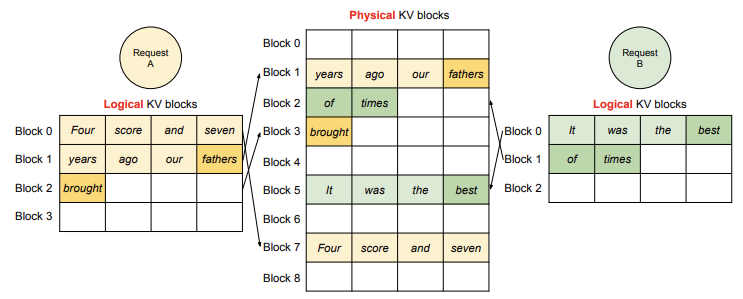

# vLLM BlockManager - NaiveBlockAllocator


在上一篇博客中，我们深入解析了 vLLM 调度器的调度策略，了解了它如何通过任务分配、优先级排序、抢占等机制在高并发请求环境下提升性能。而这一切的背后，内存管理的效率至关重要。调度器必须在 CPU 和 GPU 之间灵活分配内存，以支持生成任务的顺利执行。这一任务的核心正是由 **BlockSpaceManager** 来完成。

在 vLLM 中，`BlockSpaceManager` 和 `BlockAllocator` 共同承担了生成过程中内存分配、动态调整和缓存管理的职责。它们直接影响到高效处理 `waiting`、`running` 和 `swapped` 三个状态队列中的请求：如何在不同阶段为任务分配内存资源，如何优化 GPU 和 CPU 间的数据交换，如何避免内存瓶颈。这些都是 `BlockSpaceManager` 需要解决的问题。

本篇博客将介绍 `BlockSpaceManager` 的设计和实现，聚焦其在不同状态队列中如何分配和管理内存资源。需要注意的是，`BlockAllocator` 目前支持多种类型的内存分配器。**在这里，我们将重点介绍 `NaiveBlockAllocator` 的实现，不涉及更为复杂的 `PrefixCachingBlockAllocator`。**

:::note

本系列的代码基于 vLLM 的 0.6.3 版本介绍

:::


## 1. BlockSpaceManager 的架构概览

在 vLLM 系统中，BlockSpaceManager 负责为调度器的请求提供动态内存管理，其架构设计旨在实现高效的 GPU/CPU 内存分配和切换。为了支持调度器在不同请求状态下（如 waiting、running、swapped）的内存需求，BlockSpaceManager 采用了 BlockAllocator 模块对物理内存进行细化管理。NaiveBlockAllocator 是 BlockAllocator 的一种实现，提供了基础的内存块分配和管理能力，适用于不需要复杂缓存机制的场景。

### 1.1 BlockSpaceManager 管理策略

BlockSpaceManager 的管理策略围绕三个核心目标展开：**分配、动态扩展、和交换内存**。在调度器处理请求的过程中，不同状态的请求会对内存提出不同的需求。BlockSpaceManager 通过 BlockAllocator 将内存资源拆分为小块（blocks），并灵活地将这些块分配到 waiting、running 和 swapped 状态队列中的请求。

- **分配**：当请求进入 waiting 状态时，BlockSpaceManager 创建并分配一个初始 BlockTable，用于预填充所需的内存。
- **动态扩展**：对于 running 状态的请求，在生成新 token 时，需要追加更多内存块以支持解码阶段。BlockAllocator 动态扩展 BlockTable，确保请求可以在 GPU 内存中进行连续解码。
- **交换**：当 GPU 内存资源不足时，部分 running 队列的请求将转移至 swapped 队列。BlockSpaceManager 通过 NaiveBlockAllocator 将内存块从 GPU 移至 CPU，腾出 GPU 空间以供高优先级任务使用。

### 1.2 各组件的角色

在 BlockSpaceManager 中，内存块的分配与管理主要由以下几个关键组件协作完成：

- **BlockAllocator**：提供底层的内存块分配接口，包括块的分配、扩展、和交换。NaiveBlockAllocator 是该接口的一种简单实现，通过一系列的块管理方法（如 `allocate_immutable_blocks`, `append_slots`, `swap_out` 等）来支持基本的内存操作。
- **BlockTable**：表示一个请求的内存块表，用于记录和追踪分配给特定 Sequence 或 SequenceGroup 的物理块。BlockTable 是内存管理的核心数据结构，提供了内存块的分配和回收机制。
- **Sequence 和 SequenceGroup**：代表了请求中的一系列 token 序列。Sequence 是基本的序列单位，而 SequenceGroup 则是多个 Sequence 的集合。当一个请求进入调度器时，BlockSpaceManager 会为 SequenceGroup 创建一个或多个 BlockTable，用于存储序列所需的内存块。
- **Block**：Block 是内存的基本单位。在 NaiveBlockAllocator 中，Block 表示一个固定大小的内存区域，用于存储 token IDs。在解码阶段，每当需要生成新 token 时，BlockSpaceManager 会在 BlockTable 中追加新的 Block。

## 2. 内存分配与管理机制

### 2.1 调度器何时使用 BlockAllocator

在 **vLLM 调度器**中，`BlockAllocator` 作为内存管理的核心模块，负责为生成任务中的不同阶段提供动态的内存块分配。具体来说，`BlockAllocator` 在 `prefill`（预填充）和 `decode`（解码）两个阶段起到关键作用。这两个阶段对应着生成过程中任务状态的变化，而 `BlockAllocator` 则根据这些变化为 `waiting` 队列和 `running/swapped` 队列中的请求提供所需的内存支持。

**在 prefill 阶段**，调度器**在请求进入生成任务前会预分配初始内存。这个阶段主要用于将请求的初始 token 加载到 GPU 内存中**，以便模型启动生成任务。此时，调度器会调用 `BlockAllocator` 的 `allocate` 方法，为 `waiting` 队列中的 `seq_group` 分配初始化的物理内存块，确保序列能够加载其初始数据。这一步对于模型生成任务的平稳启动至关重要。

接下来是 **decode 阶段**，这个阶段**用于请求生成 token 的过程**。随着生成的逐步进行，请求所需的内存量会动态增加。此时，调度器会调用 `append_slots` 方法，为 `running` 或 `swapped` 队列中的序列动态追加内存块，确保生成过程有足够的内存支撑。解码阶段对内存的需求较为灵活，因此 `BlockAllocator` 必须确保每个序列在需要时能获得足够的内存，避免生成过程的中断。


### 2.2 BlockTable 的内存分配

在 **vLLM** 中，`BlockTable` 是 `BlockSpaceManager` 内存管理架构的核心数据结构，承担了管理和存储序列 token 数据的职责。在具体实现中，`BlockTable` 利用 `_blocks` 列表维护实际的内存块分配，通过与 `NaiveBlockAllocator` 的交互完成内存的动态分配、扩展和释放。

#### `BlockTable` 在内存管理中的角色

`BlockTable` 的作用**类似于操作系统的页表**。每个请求的 token 数据被分割成独立的逻辑块，这些块通过 `BlockTable` 进行存储和管理，使得 vLLM 可以高效地处理生成任务中的内存需求。例如，当一个新的 `SequenceGroup` 在 `prefill` 阶段进入 `waiting` 队列时，`BlockTable` 负责在 `NaiveBlockAllocator` 的帮助下分配足够的物理块，以存储初始提示的 KV 缓存。随后在 `decode` 阶段，`BlockTable` 动态扩展以存储新生成的 token。

这种架构不仅节省了内存，还提高了生成任务的并行处理能力。不同的请求可以通过块表的管理共享有限的物理内存资源，从而支持更大的批量生成任务。

  


#### `_blocks` 列表：内存块的核心管理结构

`_blocks` 列表是 `BlockTable` 的核心数据结构，用于存储实际分配的内存块。`_blocks` 中的每个元素都是一个 `Block` 实例，代表了一个逻辑存储块，包含一定数量的 token 数据。当一个 `Sequence` 需要扩展存储空间时，`BlockTable` 会通过 `NaiveBlockAllocator` 动态分配新的内存块，并将这些块添加到 `_blocks` 中。

以下是 `BlockTable` 中 `_blocks` 列表的结构与管理机制的关键代码：

```python
class BlockTable:
    def __init__(self, block_size: int, block_allocator: DeviceAwareBlockAllocator, ...):
        self._block_size = block_size
        self._allocator = block_allocator
        self._blocks: BlockList = BlockList(_blocks or [])
        ...
```

在这里，`_blocks` 初始化为空列表，代表一个新请求的存储空间。随着生成任务的执行，`_blocks` 列表会动态扩展，新增的物理块由 `block_allocator` 分配。例如，`allocate` 方法通过调用 `_allocate_blocks_for_token_ids` 分配所需的内存块，并将这些块更新到 `_blocks` 中。

#### `NaiveBlockAllocator` 如何支持 `BlockTable` 的动态扩展

`BlockTable` 通过 `NaiveBlockAllocator` 进行内存分配和扩展，确保每个生成任务在需要时获得合适的内存空间。具体来说，当需要为 `SequenceGroup` 分配新的 KV 缓存空间时，`NaiveBlockAllocator` 会根据请求所需的 token 数量计算需要的内存块数量并逐步分配。以下代码展示了 `allocate` 方法如何使用 `NaiveBlockAllocator` 动态分配存储空间：

```python
def allocate(self, token_ids: List[int], device: Device = Device.GPU) -> None:
    blocks = self._allocate_blocks_for_token_ids(prev_block=None, token_ids=token_ids, device=device)
    self.update(blocks)
    ...
```

在上述代码中，`allocate` 方法调用 `_allocate_blocks_for_token_ids`，根据 token 数量计算需要的块数并分配。分配完成后，通过 `update` 将这些块加载到 `_blocks` 列表中。 `_allocate_blocks_for_token_ids` 我们等会再详细介绍。

#### `BlockTable` 内存扩展与回收机制

随着生成任务的执行，`BlockTable` 中的 `_blocks` 列表会动态增加新的块，为生成的 token 提供存储空间。而当一个 `Sequence` 生成任务完成后，`BlockTable` 会调用 `free` 方法释放所占用的内存块，为后续任务腾出空间。每个物理块在完成使用后，通过 `NaiveBlockAllocator` 归还到内存池中，供其他请求复用。这种设计能够高效利用 GPU 内存，提高生成任务的吞吐量。

通过 `BlockTable` 的分层管理和 `NaiveBlockAllocator` 的动态分配机制，vLLM 实现了内存资源的高效利用，满足了多任务并发处理的需求。


### 2.3 BlockTable 内存管理方法解析

在 `BlockTable` 中，内存管理方法负责高效分配和管理内存块，以支持不同阶段的请求需求。这些方法在 `NaiveBlockAllocator` 的协作下，通过动态分配和扩展策略，使调度器可以灵活应对序列生成过程中的存储需求。以下对主要内存管理方法进行深入解析：

#### 预分配存储空间：等待序列的内存准备

`allocate` 方法用于预先分配存储空间，尤其是针对 `waiting` 队列中序列的 `prefill` 操作。此方法会根据初始提示长度和生成任务所需的 KV 缓存大小，通过 `_allocate_blocks_for_token_ids` 为每个序列分配一个或多个块，并将这些块更新到 `_blocks` 列表中。

```python
def allocate(self, token_ids: List[int], device: Device = Device.GPU) -> None:
    blocks = self._allocate_blocks_for_token_ids(prev_block=None, token_ids=token_ids, device=device)
    self.update(blocks)
    self._num_full_slots = len(token_ids)
```

`allocate` 首先调用 `_allocate_blocks_for_token_ids` 根据 `token_ids` 的数量和块大小动态计算需要的块数，并逐一分配。分配完成后，这些块被添加到 `_blocks` 中。`_num_full_slots` 则更新当前分配的 token 数量，用于后续内存操作的参考。

#### 动态扩展：解码阶段的内存追加

在 `decode` 阶段，`running` 和 `swapped` 队列中的序列需要不断生成新的 token。`append_token_ids` 允许动态扩展 `BlockTable`，为新生成的 token 分配空间。通过追加 token 数据到现有块或者分配新块，该方法确保 decode 阶段的内存需求得到满足。

```python
def append_token_ids(self, token_ids: List[int], num_lookahead_slots: int = 0, num_computed_slots: Optional[int] = None) -> None:
    # 确保分配足够的空余空间
    self.ensure_num_empty_slots(num_empty_slots=len(token_ids) + num_lookahead_slots)

    # 获取当前块表的起始索引，分块存储 token_ids
    first_block_idx = self._num_full_slots // self._block_size
    token_blocks = self._chunk_token_blocks_for_append(token_ids)

    # 将每块 token 数据存入对应的块
    for i, token_block in enumerate(token_blocks):
        self._blocks.append_token_ids(first_block_idx + i, token_block)

    self._num_full_slots += len(token_ids)
```

`append_token_ids` 通过 `ensure_num_empty_slots` 检查是否有足够空间以存储 `token_ids` 和指定的 `lookahead` 数据，确保无中断的生成过程。随后，`_chunk_token_blocks_for_append` 方法将 `token_ids` 分为块大小的子集，并逐一追加到 `BlockTable` 的 `_blocks` 列表中。最终 `_num_full_slots` 更新为当前存储的总 token 数。

#### 空闲槽位检查与动态分配

`ensure_num_empty_slots` 确保当前 `BlockTable` 中的空闲槽位足够容纳新的 token 数据。在不足的情况下，方法会调用 `NaiveBlockAllocator` 动态分配新块。

```python
def ensure_num_empty_slots(self, num_empty_slots: int) -> None:
    # 当前已有空闲空间满足需求，直接返回
    if self._num_empty_slots >= num_empty_slots:
        return

    # 计算需要的新增槽位并分配新块
    slots_to_allocate = num_empty_slots - self._num_empty_slots
    blocks_to_allocate = cdiv(slots_to_allocate, self._block_size)

    for _ in range(blocks_to_allocate):
        self._blocks.append(self._allocator.allocate_mutable_block(prev_block=self._blocks[-1], device=Device.GPU))
```

在此方法中，`_num_empty_slots` 表示当前剩余的空闲槽位。如果空闲空间不足，则计算所需的新槽位数量并通过 `NaiveBlockAllocator` 逐块分配，使得 `BlockTable` 满足新的存储需求。

#### 计算资源需求与空间分配

在 `prefill` 和 `decode` 阶段，`BlockTable` 利用辅助方法评估所需资源量并动态分配内存，确保资源分配的准确性。`get_num_required_blocks` 方法在分配初期帮助确定所需的最小块数，而 `get_num_blocks_touched_by_append_slots` 则在扩展阶段计算追加操作影响的块数。

```python
@staticmethod
def get_num_required_blocks(token_ids: List[int], block_size: int, num_lookahead_slots: int = 0) -> int:
    return cdiv(len(token_ids) + num_lookahead_slots, block_size)
```

在动态扩展阶段，`get_num_blocks_touched_by_append_slots` 方法提供了精确的块数计算，用于指导调度器在 decode 阶段合理分配内存资源。

```python
def get_num_blocks_touched_by_append_slots(self, token_ids: List[int], num_lookahead_slots: int) -> int:
    num_token_ids = len(token_ids) + num_lookahead_slots
    first_chunk_size = self._block_size - (self._num_full_slots % self._block_size)
    num_token_blocks = 1 + math.ceil((num_token_ids - first_chunk_size) / self._block_size)
    return num_token_blocks
```

这两种计算方法为调度器的资源分配提供了精确的数据支撑，提升了系统的内存利用效率。

### 2.4 调度阶段的内存分配流程

在 vLLM 的内存分配架构中，不同阶段的请求需要不同的内存分配策略来保证生成任务的流畅性。BlockSpaceManager 通过 `allocate` 和 `append_slots` 等方法来管理这些内存块的分配和扩展，以适应 `waiting`、`running、`swapped` 队列中请求的实际需求。

#### 内存分配初始化：`waiting` 队列的处理

当一个请求被加入 `waiting` 队列时，我们需要先为其分配基本的内存空间。这时，调度器会调用 `allocate` 方法为其分配预填充（`prefill`）阶段所需的内存块。

`allocate` 方法的任务是将请求的 token 映射到内存块中。它会调用 `_allocate_blocks_for_token_ids` 方法，将一批 token 按需分配到一个或多个块中。这样，`waiting` 队列中的每个请求都能在 `prefill` 阶段拥有足够的内存。

```python
def allocate(self, token_ids: List[int], device: Device = Device.GPU) -> None:
    # 通过内部方法为 token 分配物理块
    blocks = self._allocate_blocks_for_token_ids(prev_block=None, token_ids=token_ids, device=device)
    self.update(blocks)
    self._num_full_slots = len(token_ids)
```

`allocate` 方法做了两件关键的事情：

1. **块分配**：它调用 `_allocate_blocks_for_token_ids`，为传入的 `token_ids`（即请求的 token 序列）分配所需的物理内存块。
2. **更新块表**：分配的块会被添加到 `BlockTable` 中，确保后续访问能找到这些 token 数据所在的内存块。

```python
def _allocate_blocks_for_token_ids(self, prev_block: Optional[Block], token_ids: List[int], device: Device) -> List[Block]:
    blocks: List[Block] = []
    for cur_token_ids in chunk_list(token_ids, self._block_size):
        # 满块直接分配为 immutable（不可变）块
        if len(cur_token_ids) == self._block_size:
            blocks.extend(self._allocator.allocate_immutable_blocks(prev_block, block_token_ids=[cur_token_ids], device=device))
        else:
            # 不满块分配为 mutable（可变）块
            block = self._allocator.allocate_mutable_block(prev_block=prev_block, device=device)
            block.append_token_ids(cur_token_ids)
            blocks.append(block)
        prev_block = blocks[-1]
    return blocks
```

在这段代码中，每个块的分配逻辑如下：

- **满块分配**：如果 `token_ids` 刚好填满一个块，则直接分配为不可变块。
- **不满块分配**：若 token 数据无法填满一个完整的块，则分配为可变块，以便后续可以继续添加数据。

当 `allocate` 完成时，`waiting` 队列中的请求已经获得了 `prefill` 阶段所需的内存，并且 `BlockTable` 已记录所有分配的内存块。


#### 解码阶段的动态扩展：`running` 和 `swapped` 队列

在进入 `decode` 阶段后，请求会被移动到 `running` 或 `swapped` 队列中。在这一阶段，生成的 token 数据量是动态增加的，因此 `BlockTable` 需要支持内存的动态扩展，这时就会用到 `append_slots` 方法。


`append_slots` 方法通过 `append_token_ids` 将新的 token 数据追加到已有的内存块中，并在空间不足时动态分配新的块。这样可以保证 `running` 和 `swapped` 队列中的请求在解码过程中能够获得持续的内存支持。

```python
def append_slots(self, seq: Sequence, num_lookahead_slots: int) -> List[Tuple[int, int]]:
    block_table = self.block_tables[seq.seq_id]
    # 动态追加 token 到现有块中，不足时自动扩展
    block_table.append_token_ids(token_ids=block_table.get_unseen_token_ids(seq.get_token_ids()), num_lookahead_slots=num_lookahead_slots)
    new_cows = self.block_allocator.clear_copy_on_writes()
    return new_cows
```

`append_slots` 方法的主要逻辑是：

1. **获取未分配的 token**：`get_unseen_token_ids` 会筛选出还未追加到 `BlockTable` 的 token 数据。
2. **追加或扩展**：调用 `append_token_ids` 方法将这些新 token 追加到现有内存块中。若空间不足，`append_token_ids` 会自动扩展新的块以容纳新增的 token。


在 `append_token_ids` 方法内部，`ensure_num_empty_slots` 会检查是否有足够的空余槽位，若不足则调用 `NaiveBlockAllocator` 分配新的块：

```python
def append_token_ids(self, token_ids: List[int], num_lookahead_slots: int = 0) -> None:
    # 确保有足够的空余槽位，动态追加块
    self.ensure_num_empty_slots(len(token_ids) + num_lookahead_slots)
    first_block_idx = self._num_full_slots // self._block_size
    token_blocks = self._chunk_token_blocks_for_append(token_ids)
    for i, token_block in enumerate(token_blocks):
        self._blocks.append_token_ids(first_block_idx + i, token_block)
    self._num_full_slots += len(token_ids)
```

在这里，`ensure_num_empty_slots` 会根据需要追加新的内存块，并逐块存储新生成的 token。对于解码阶段，这种动态扩展机制确保了 `running` 和 `swapped` 队列能够随时应对新增的生成内容。

综上所述，`BlockTable` 和 `NaiveBlockAllocator` 在不同的调度阶段各有分工：

- 在 `waiting` 队列的 `prefill` 阶段，`allocate` 方法预分配必要的内存。
- 在 `running` 和 `swapped` 队列的 `decode` 阶段，`append_slots` 动态扩展以满足实时生成的 token 数据。

这种分配机制在保证内存使用效率的同时，兼顾了扩展性，使得 vLLM 能够更高效地管理资源，从而提高解码过程的吞吐量和响应速度。


## 3. 交换（Swap）机制与缓存策略

### 3.1 交换机制的应用场景

在 vLLM 的生成任务中，GPU 内存资源通常十分宝贵，因此需要高效管理以确保模型推理和生成的顺利进行。交换机制（Swap）在这种场景下显得尤为重要。交换机制的核心思想是，当 GPU 内存资源不足时，将低优先级任务或当前未活跃的任务暂时从 GPU 转移至 CPU。

在代码层面上，交换的背景和应用场景可以进一步解释为：

1. 资源不足时的调度优先级：在 `can_swap_in` 和 `can_swap_out` 的实现中，BlockSpaceManager 会通过检测当前 GPU 的空闲内存块数与设定的 watermark 水位值来判断是否需要交换任务。这并不是简单的“低优先级转移”，而是基于实际的内存占用情况做出的动态调整。只有在内存紧张时，才会调用 `swap_out` 方法将任务转移至 CPU。
2. 多步调度触发的动态交换：`swap_in` 和 `swap_out` 的调用并不是直接基于任务的活跃性，而是根据任务在 running 和 swapped 队列中的状态。对于不活跃或暂时未进行解码的序列，调度器会优先尝试转移至 CPU，从而释放 GPU 内存给当前运行的任务。这里的状态转换是通过 `SequenceStatus` 管理的，而非直接依据任务优先级。

### 3.2 swap_in 和 swap_out 实现与状态管理

在 vLLM 的内存管理中，`swap_in` 和 `swap_out` 是两个关键方法，用于在 GPU 和 CPU 间交换内存，确保 GPU 有足够的空间处理当前任务，而不影响已经存在的任务状态。`swap_in` 负责将任务从 CPU 转移回 GPU，以便继续运行；而 `swap_out` 则将暂时不需要处理的数据从 GPU 转移到 CPU，释放 GPU 内存给其他任务。下面我们逐步剖析 `swap_in` 和 `swap_out` 的代码实现细节，理解其如何维护内存的连续性和数据一致性。

#### `swap_out`：释放 GPU 内存

当 GPU 内存紧张时，调度器通过 `swap_out` 方法将一部分内存块移至 CPU，以释放 GPU 资源。具体来说，`swap_out` 的流程如下：

1. **找到需要转移的内存块**：`swap_out` 会遍历传入的序列组 `seq_group` 中的每个序列（`seq`），并通过其在 `BlockTable` 中的内存块列表获取该序列所占用的所有 GPU 内存块。
   
2. **执行交换操作**：`swap_out` 调用 `block_allocator.swap` 将 GPU 内存块的内容复制到 CPU 内存中，并记录下交换前后的内存块 ID 对应关系。为了确保一致性，它更新了 `BlockTable` 中的内存块信息。

3. **释放 GPU 内存**：当所有的内存块都成功转移到 CPU 后，`swap_out` 将 GPU 上对应的内存标记为可用状态，以便新任务分配。`swap_out` 通过调用 `free` 方法在 `BlockAllocator` 中释放这些块。

在代码中，`swap_out` 的大致实现如下：

```python
def swap_out(self, seq_group: SequenceGroup) -> List[Tuple[int, int]]:
    physical_block_id_mapping = []
    for seq in seq_group.get_seqs(status=SequenceStatus.RUNNING):
        blocks = self.block_tables[seq.seq_id].blocks
        if len(blocks) == 0:
            continue

        seq_swap_mapping = self.block_allocator.swap(
            blocks=blocks, src_device=Device.GPU, dst_device=Device.CPU)

        # 更新块表以反映内存交换后的状态
        self.block_tables[seq.seq_id].update(blocks)

        # 记录交换后的物理内存块 ID 映射
        seq_physical_block_id_mapping = {
            self.block_allocator.get_physical_block_id(Device.GPU, gpu_block_id):
            self.block_allocator.get_physical_block_id(Device.CPU, cpu_block_id)
            for gpu_block_id, cpu_block_id in seq_swap_mapping.items()
        }

        physical_block_id_mapping.extend(list(seq_physical_block_id_mapping.items()))

    return physical_block_id_mapping
```


- `seq_group.get_seqs(status=SequenceStatus.RUNNING)` 会筛选出在 `running` 状态的序列。
- `self.block_allocator.swap` 实现了内存块在 GPU 和 CPU 间的真正转移，将 GPU 上的块内容拷贝到 CPU 并返回交换后的块映射关系。
- 通过 `update` 方法，`BlockTable` 更新每个序列在交换后使用的块 ID，确保块表的状态始终与当前的内存布局一致。

#### `swap_in`：将数据转移回 GPU

当某个任务需要在 GPU 上继续运行时，调度器会调用 `swap_in` 方法，将任务的内存块从 CPU 转移回 GPU。流程如下：

1. **获取需要的 CPU 内存块**：`swap_in` 方法会遍历 `swapped` 状态的序列，找到对应的 CPU 内存块。
   
2. **将内存块转移回 GPU**：类似于 `swap_out`，`swap_in` 使用 `block_allocator.swap` 将 CPU 内存块重新映射到 GPU 上，同时记录下转移前后的块 ID 映射关系。

3. **更新块表信息**：`BlockTable` 中的内存块信息会随之更新，以反映新分配到的 GPU 内存地址。

`swap_in` 的核心代码如下：

```python
def swap_in(self, seq_group: SequenceGroup) -> List[Tuple[int, int]]:
    physical_block_id_mapping = []
    for seq in seq_group.get_seqs(status=SequenceStatus.SWAPPED):
        blocks = self.block_tables[seq.seq_id].blocks
        if len(blocks) == 0:
            continue

        seq_swap_mapping = self.block_allocator.swap(
            blocks=blocks, src_device=Device.CPU, dst_device=Device.GPU)

        # 刷新块表中的块信息
        self.block_tables[seq.seq_id].update(blocks)

        # 记录物理块 ID 的映射
        seq_physical_block_id_mapping = {
            self.block_allocator.get_physical_block_id(Device.CPU, cpu_block_id):
            self.block_allocator.get_physical_block_id(Device.GPU, gpu_block_id)
            for cpu_block_id, gpu_block_id in seq_swap_mapping.items()
        }

        physical_block_id_mapping.extend(list(seq_physical_block_id_mapping.items()))

    return physical_block_id_mapping
```

#### 状态一致性和内存管理的结合

`swap_in` 和 `swap_out` 的设计关键在于保证内存状态的一致性。`swap_in` 会确保转回 GPU 的块映射是最新的，而 `swap_out` 则及时释放不需要的 GPU 内存。

### 3.3 watermark 策略

简单来说，watermark 是一个内存使用的下限。它帮助系统在 GPU 内存即将耗尽前提前做出反应，而不是等到内存用光时再仓促处理。这样，系统可以更加从容地将低优先级任务的数据转移到 CPU，以便将宝贵的 GPU 资源腾出来供更紧急的任务使用。

在 `SelfAttnBlockSpaceManager` 中，watermark 的值通过构造函数传递，表示一个占总 GPU 内存比例的阈值。例如：

```python
self.watermark = watermark  # 表示 GPU 总块数的阈值比例
self.watermark_blocks = int(watermark * num_gpu_blocks)  # 转化为实际块数
```

假设 `watermark` 被设置为 0.1，且 GPU 上有 1000 个内存块，那么 `watermark_blocks` 的值为 100。当 GPU 的剩余内存块数量低于 100 时，系统会考虑触发交换操作。

在判断是否需要交换时，`can_swap_in` 和 `can_swap_out` 两个方法分别会检查当前的内存使用情况，并将 watermark 作为一个重要的参考条件。 后面我们将详细介绍这两个方法的实现。

通过设置 `watermark`，系统可以避免频繁且耗时的内存交换操作。换句话说，`watermark` 让系统在内存充足时尽量保持任务在 GPU 上执行，而不是频繁地在 GPU 和 CPU 间来回交换数据，从而减少了不必要的数据传输开销。这一策略对于高效地利用 GPU 资源尤为重要，因为频繁的交换操作会阻碍 GPU 的计算能力，降低整体吞吐量。

此外，`watermark` 也减少了 GPU 上“最后一刻”分配内存的风险。通过提前判断并触发交换，系统能确保高优先级任务在内存紧张的情况下优先获得 GPU 资源，从而提高任务的响应速度。

### 3.4 内存判定逻辑：can_swap_in 和 can_swap_out

在 `BlockAllocator` 中，`can_swap_in` 和 `can_swap_out` 这两个方法是实现交换机制的核心。它们通过判断当前内存状态来决定是否可以进行数据交换，从而在内存不足时有效地管理资源。接下来，我们通过代码逐步深入分析它们的实现逻辑。

#### can_swap_in：判断序列是否可以从 CPU 交换到 GPU

当某个任务进入调度流程并准备从 CPU 移入 GPU 内存时，`can_swap_in` 会先检查 GPU 是否有足够的空间来容纳需要交换的块。这个方法的核心逻辑是计算出交换所需的块数量，然后与当前 GPU 可用的内存块数进行比较。若空间充足，才允许进行 `swap_in` 操作。

```python
def can_swap_in(self, seq_group: SequenceGroup, num_lookahead_slots: int) -> AllocStatus:
    """
    判断指定的序列组是否可以交换到 GPU 上。
    
    Args:
        seq_group (SequenceGroup): 需要交换到 GPU 的序列组。
        num_lookahead_slots (int): 需要提前分配的槽位数量（在推测性解码中使用）。

    Returns:
        AllocStatus: 表示分配状态的枚举，可能的值为 OK、LATER 或 NEVER。
    """
    # 调用私有方法 _can_swap 来判断是否满足交换条件
    return self._can_swap(seq_group, Device.GPU, SequenceStatus.SWAPPED, num_lookahead_slots)
```

`can_swap_in` 的实现逻辑其实依赖于 `_can_swap` 方法，这个方法会先计算该序列在 GPU 上需要的总块数，然后结合当前 GPU 的空闲块数来判断是否能满足需求。

#### can_swap_out：判断是否可以将序列从 GPU 交换到 CPU

在资源紧张的情况下，需要将某些在 GPU 上执行的任务换出至 CPU，以释放 GPU 空间。`can_swap_out` 方法会检查是否有足够的 CPU 内存来存储该任务的数据，以决定能否将其交换出 GPU。

```python
def can_swap_out(self, seq_group: SequenceGroup) -> bool:
    """
    判断是否可以将指定的序列组从 GPU 交换到 CPU。
    
    Args:
        seq_group (SequenceGroup): 要交换的序列组。

    Returns:
        bool: 若可以交换出返回 True，否则返回 False。
    """
    # 通过 _can_swap 方法确定交换状态是否为 OK
    alloc_status = self._can_swap(seq_group, Device.CPU, SequenceStatus.RUNNING)
    return alloc_status == AllocStatus.OK
```

#### 代码中的关键步骤：_can_swap

我们来看 `_can_swap` 方法的核心部分，理解如何判断交换状态，`_can_swap` 的关键步骤如下：

1. **计算触及的块数**：在 `_can_swap` 中，通过遍历 `seq_group` 中的每个序列，计算其在交换后的完整块需求。
2. **检查水位线限制**：该逻辑利用 `watermark_blocks` 设置的水位线来避免频繁交换，确保只有当 GPU 块数足够时才执行交换。
3. **返回状态**：根据可用块数返回 `AllocStatus.OK`（可交换），`AllocStatus.LATER`（稍后再尝试），或 `AllocStatus.NEVER`（不可能交换）。


```python
def _can_swap(self, seq_group: SequenceGroup, device: Device, status: SequenceStatus, num_lookahead_slots: int = 0) -> AllocStatus:
    """
    检查指定序列组在指定设备上是否满足交换条件。
    
    Args:
        seq_group (SequenceGroup): 需要检查的序列组。
        device (Device): 目标设备（GPU 或 CPU）。
        status (SequenceStatus): 当前序列状态。
        num_lookahead_slots (int): 需要提前分配的槽位数量。

    Returns:
        AllocStatus: 返回分配状态，可能的值为 OK、LATER 或 NEVER。
    """
    # 计算需要的完整块数
    num_blocks_touched = 0
    blocks = []

    for seq in seq_group.get_seqs(status=status):
        block_table = self.block_tables[seq.seq_id]
        if block_table.blocks:
            # 计算触及块数，包括未分配的附加槽位
            num_blocks_touched += block_table.get_num_blocks_touched_by_append_slots(
                block_table.get_unseen_token_ids(seq.get_token_ids()), num_lookahead_slots)
            blocks.extend(block_table.blocks)
    
    # 检查设备上是否有足够的空闲块以满足交换需求
    num_blocks_touched += self.block_allocator.get_num_full_blocks_touched(blocks, device=device)
    watermark_blocks = self.watermark_blocks if device == Device.GPU else 0

    # 确认是否满足交换条件
    if self.block_allocator.get_num_total_blocks(device) < num_blocks_touched:
        return AllocStatus.NEVER
    elif self.block_allocator.get_num_free_blocks(device) - num_blocks_touched >= watermark_blocks:
        return AllocStatus.OK
    else:
        return AllocStatus.LATER
```

## 4. 总结

在这篇文章中，我们深入解析了 `BlockSpaceManager` 的架构与核心功能，展示了其在内存分配、动态扩展以及交换机制中的重要作用。`BlockSpaceManager` 类似于一种轻量的内存管理器，帮助生成任务在有限的内存资源下实现高效运行。通过 `BlockAllocator` 的配合，`BlockSpaceManager` 能够在任务的不同阶段智能分配和调整内存块，确保请求在预填充（prefill）、解码（decode）和交换（swap）阶段拥有足够的资源。后面我们还会介绍 PrefixCachingBlockAllocator 的实现细节。

## 参考文献

1. https://zhuanlan.zhihu.com/p/700780161
2. https://arxiv.org/pdf/2309.06180
3. https://github.com/vllm-project/vllm/blob/main/vllm/core/block_manager.py