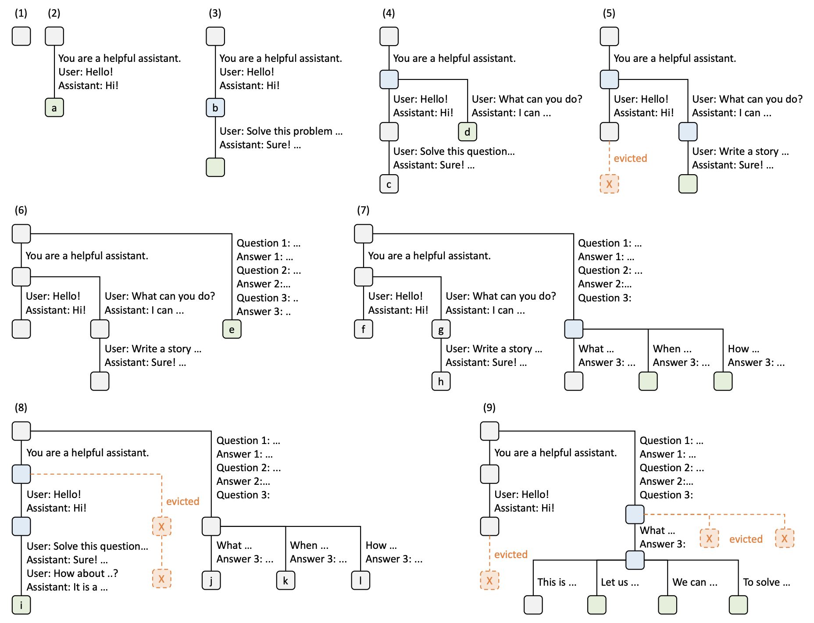

# vLLM BlockManager - PrefixCachingBlockAllocator

在上一篇博客中，我们详细探讨了 `BlockSpaceManager` 和 `NaiveBlockAllocator` 的设计与内存管理策略，了解了 vLLM 在生成任务中如何通过分配内存块来支持多任务并发、动态扩展及数据交换等需求。`NaiveBlockAllocator` 提供了基础的内存分配和回收机制，确保了序列在生成不同阶段（如 prefill 和 decode 阶段）所需的资源。然而，随着任务规模的增大，特别是对于频繁出现相同或相似前缀的请求，简单的内存管理策略在效率上面临瓶颈。 

在深度学习生成任务中，特别是长文本生成或多轮对话应用场景中，缓存机制显得尤为重要。每当需要重复生成某一段相同内容时，如果可以将已经生成的部分缓存下来以供复用，就能够显著降低系统的开销，提高任务效率。`vLLM` 的 `PrefixCachingBlockAllocator` 就是为了解决这一需求而设计的一种优化器，其通过前缀缓存实现了对已有内容生成结果的重用，避免了无效计算。


在长 `prompt` 场景或多轮对话生成任务中，经常会遇到相似的请求。例如，对于同一系统 `prompt` 或在多轮对话场景中需要不断复用的历史上下文，重复计算会大幅增加系统的延迟，降低处理效率。如果能在生成过程中，将相同 `prompt` 的计算结果以 KV 缓存的形式保存下来，供后续请求复用，不仅可以节省内存和计算资源，还可以减少首 `token` 的生成时间。

`vLLM` 中的 `PrefixCachingBlockAllocator` 主要基于 `RadixAttention` 算法实现，该算法通过基数树的结构来高效地复用相似前缀内容。在 `vLLM` 的缓存体系中，`PrefixCaching` 不仅缓存 `prefix` 阶段的 KV 数据，还包括生成阶段的 `KV` 缓存数据。`RadixAttention` 则通过标识内容的 `hash` 方式来唯一标识不同的缓存单元，并在必要时动态生成 `KV` 缓存块。这种设计方式，避免了多轮对话或长 `prompt` 生成中大量重复计算。


本篇文章将深入分析 `PrefixCachingBlockAllocator` 的整体架构与内部机制，主要涵盖以下几点：
1. **Prefix Caching 的核心原理**：介绍 `RadixAttention` 算法的应用，及其在 `PrefixCaching` 中的作用。
2. **缓存复用的具体实现**：讲解 `allocate_immutable_block` 方法如何实现基于内容的缓存复用。
3. **状态管理和块分配策略**：分析 `BlockTracker`、`Evictor` 等核心组件如何协作管理缓存状态，保证高效利用内存。
4. **多轮对话和生成优化**：通过典型应用场景展示 `PrefixCaching` 的具体优化效果。

通过本篇分析，希望能帮助大家更好地理解 `vLLM` 的缓存机制，挖掘 `PrefixCaching` 在生成任务中的优势，并在实践中灵活运用以提升生成效率。

:::note

本系列的代码基于 vLLM 的 0.6.3 版本介绍

:::

## 1. Prefix Caching：RadixAttention 原理及应用

### 1.1 RadixAttention 的基本原理

`RadixAttention` 是一种创新的缓存机制，利用基数树（Radix Tree）的数据结构来管理和复用缓存。它的核心思想是通过共享公共前缀的内容，减少在生成任务中重复计算的成本，尤其是在对话生成和长 `prompt` 场景下尤为有效。

> 基数树如何用于缓存复用?

基数树是一种压缩的前缀树结构，常用于存储具有相同前缀的字符串。在 `RadixAttention` 中，基数树的每个节点代表一个内容块，节点之间的边代表着从父节点到子节点的前缀关系。通过这样的树结构，我们可以高效地存储和复用具有相同前缀的内容。例如：

- 在长 prompt 生成任务中，如果两个不同的请求都包含相似的系统 prompt，这些内容就可以被映射到树的同一条路径上。这样后续的请求就不需要重新计算已有的部分。
- 在多轮对话的生成任务中，前几轮的 KV 数据被保留在前缀缓存中，后续轮次的请求直接复用已有的前缀，减少重复计算。

### 1.2 Radix Tree 与 Prefix Tree 的区别

`Radix Tree` 和 `Prefix Tree` 在结构上有所不同，尤其是在处理共享前缀的数据场景中，`Radix Tree` 更为灵活和高效。具体来说：

-   **Radix Tree 的分片特性**：`Radix Tree` 支持节点的内容以“片段”形式存储，即一个节点不仅可以包含一个字符（或一个 token），还可以包含一段连续的字符串或 token 序列。这样，当多个请求共享一段较长的前缀时，`Radix Tree` 可以将该前缀作为一个整体存储，而不是像 `Prefix Tree` 那样逐字符或逐 token 进行分解。
-   **动态调整特性**：`Radix Tree` 能够根据新请求的内容对现有节点进行动态分裂。例如，如果一个请求和已有缓存的前缀部分重合，但有部分不同，`Radix Tree` 会将共同的前缀保留为一个节点，随后创建新的分支节点。这一特性极大地提高了缓存的复用率和效率，尤其适用于大模型推理中的对话生成和长 `prompt` 处理。

在多轮对话或长 `prompt` 场景中，这种动态分片和调整的能力让 `Radix Tree` 能更好地组织和管理大量重叠的上下文。例如，在对话系统中，如果用户在一轮对话中询问了多种问题，每个问题的开头可能相同，但后续内容不同。`Radix Tree` 可以在保留共同开头的同时，为每个分支问题创建单独的节点，最大限度地复用共享的前缀内容。

### 1.3 Prefix + Generated KV Caching

在大型语言模型推理过程中，生成任务涉及多个阶段的计算，特别是 `Prefix` 阶段（生成开始时的前缀部分）和 `Generate` 阶段（生成过程中新产生的部分）。为减少计算量并提高生成效率，`PrefixCachingBlockAllocator` 引入了 `Prefix + Generated KV Caching`，即在生成任务中缓存并复用 KV 数据，避免重复计算。

### 1.4 RadixAttention 的工作流程

1. **构建基数树**：对于每一个 `prompt` 和生成内容，通过计算其哈希值，生成一个唯一的缓存标识。然后，将该标识映射到基数树上合适的节点，确保共享前缀的内容被映射到同一分支中。
2. **复用缓存**：当新的请求到来时，`RadixAttention` 查找树中的已有路径，复用前缀相同的缓存块。只有当 `prompt` 的内容发生变化时，才会创建新的节点，存储该内容的缓存数据。
3. **动态拆分和管理缓存**：如果遇到相似的 `prompt` 请求而不完全相同，则会根据需求将较大的缓存块拆分，创建小的分支节点，以便不同请求共享同一系统 `prompt` 的缓存块。

  

上展示了 `RadixAttention` 在对话和长 `prompt` 缓存中的工作流程。 在最开始，基数树是空的。随着第一个用户请求 `"Hello!"` 到来，系统生成了回复 `"Hi!"`。整个对话（包括系统提示 `"You are a helpful assistant"`）被合并为一个节点 `a` 存储在基数树中。

当用户再次请求 `"Hello!"` 时，系统直接复用了之前节点 `a` 中缓存的内容，生成同样的响应 `"Hi!"`。之后，用户提出新的问题（如 `"Solve this problem ..."`），该对话内容被存储在一个新节点 `b` 中。此时基数树上保存了不同对话分支，并共享了同样的前缀节点 `a`。

随着更多不同请求的加入（如 `"What can you do?"` 和 `"Write a story ..."`），系统开始在不同请求中共享公共前缀，并在需要时分裂节点。对于共享的 `prompt`，系统不会重复计算，而是复用已有的前缀节点数据。

当内存资源不足时，某些节点会被“逐出”（`evicted`），如图中第 5 步所示。节点 `c` 被清除以释放内存，为新的请求腾出空间。系统基于 LRU（最近最少使用）策略，将最久未使用的缓存逐出。

基数树继续扩展，通过分支来适应更多请求。对于问答内容，系统将不同的问题和回答逐步增加到基数树中，并动态调整缓存。例如，图中的节点 `e` 和 `f` 代表不同的问题序列，而它们都共享同样的前缀 `d`。

在图的后几步中，基数树已经非常复杂。此时系统继续管理和复用缓存，尽量保留高频使用的前缀。当缓存压力增大时，系统会优先保留那些可能重复使用的节点，逐出那些较长时间未被使用的节点（如 `j` 和 `k` 等）。

## 2. vLLM Automatic Prefix Caching：核心架构

### 2.1 核心组件与整体设计

`PrefixCachingBlockAllocator` 是 vLLM 的核心组件之一，专注于在大语言模型推理中实现高效的前缀缓存机制。其设计目标是缓存和复用计算结果，从而显著提升生成性能。下面介绍 `PrefixCachingBlockAllocator` 的核心组件和整体设计思路。

`PrefixCachingBlockAllocator` 主要包含以下几个核心组件：

- `BlockTracker`：用于追踪每个块的状态，包括是否活跃和上次访问时间。
- `Evictor`：管理块的驱逐，按 LRU 策略释放未使用的块。
- `RefCounter`：管理每个块的引用次数，确保块在没有被使用时可以被安全回收。


`BlockTracker` 是用于跟踪每个块状态的组件。它负责记录每个内存块是否处于活动状态、是否已完成计算（computed），以及上次访问的时间（`last_accessed`）。每个块在分配后会通过 BlockTracker 进行状态管理。例如，当一个块被标记为 “active” 后，可以通过 last_accessed 记录它的访问时间，从而帮助 Evictor 决定是否将其驱逐。此外，BlockTracker 的 enable 和 disable 方法可以在块的生命周期中灵活调整状态，确保内存资源得到高效利用。

```python
class BlockTracker:
    """用于追踪块的状态，包括是否活跃和上次访问时间。"""
    __slots__ = ("active", "last_accessed", "computed")

    def __init__(self):
        self.active: bool = False
        self.reset()

    def reset(self):
        """重置块状态，包括访问时间和计算状态。"""
        self.last_accessed: float = _DEFAULT_LAST_ACCESSED_TIME
        self.computed: bool = False

    def enable(self):
        """激活块，重置状态。"""
        assert not self.active
        self.active = True
        self.reset()

    def disable(self):
        """禁用块，重置状态。"""
        assert self.active
        self.active = False
        self.reset()
```

例如，在一个多轮对话中，前几轮对话产生的 KV 数据块可以被标记为“已完成计算”（computed）。这样，BlockTracker 确保系统不会重复计算这些已经存在的块，从而大大节省了计算资源。

`Evictor` 是 `PrefixCachingBlockAllocator` 中负责缓存块的驱逐和回收的组件。通过 LRU（Least Recently Used）策略，它可以有效地管理缓存中的数据，释放不再使用的块以供新的请求使用。`Evictor` 的设计基于一个 `free_table`，用于保存最近未使用的缓存块。当内存压力增大时，`Evictor` 会优先驱逐那些访问时间最久远的块，以腾出空间。通过这种设计，系统可以保持较高的缓存命中率，同时在内存受限的情况下，尽量避免占用宝贵的 GPU 资源。

```python
class Evictor:
    """管理块的驱逐，按 LRU 策略释放未使用的块。"""
    def add(self, block_id, content_hash, num_tokens_total, last_accessed):
        """将块添加到 free_table 中，准备驱逐。"""
        # 代码省略，逻辑为按访问时间顺序排序

    def remove(self, content_hash):
        """从 free_table 中移除块，用于复用。"""
        # 逻辑实现略

    def evict(self):
        """逐出最近最少使用的块，确保缓存的高效利用。"""
        # 逻辑实现略
```

通过 `add` 和 `evict` 方法，`Evictor` 实现了对未使用块的管理与回收。比如，当新的请求需要内存时，可以调用 `evict` 方法驱逐最旧的块，从而释放空间。这种 LRU 策略确保了缓存的最优利用，最大限度提高了系统的吞吐量和性能。

举个例子：假设某个块在过去的对话轮次中已经被多次引用，但当前轮次不再需要它，那么 Evictor 会将该块标记为“待释放”。这种设计使得系统可以在内存压力增大时自动清理旧数据，以腾出空间供新请求使用，同时避免频繁的内存分配和回收。

`RefCounter` 是用于管理每个块的引用次数的组件。它在 `PrefixCachingBlockAllocator` 中扮演关键角色，确保每个块在没有被使用时可以被安全回收，而在被多次引用时则保留在缓存中。通过 `RefCounter`，每个块的引用计数得以精确控制。例如，当引用计数减为零时，`Evictor` 可以将该块驱逐；而当引用计数增加时，则表示该块正在被活跃使用，不应回收。这种设计极大地优化了缓存的利用率，避免不必要的重复计算。

```python
class RefCounter:
    """引用计数器，管理每个块的引用次数。"""
    def incr(self, block_id):
        """增加块的引用计数。"""
        # 代码省略

    def decr(self, block_id):
        """减少块的引用计数，引用计数为0时释放块。"""
        # 代码省略
```

引用计数器的 `incr` 和 `decr` 方法确保了块的正确管理。每次分配新的块，引用计数器会自增，而当引用计数归零时，系统会将该块交给 `Evictor` 处理。这样，即便在高并发的生成任务中，系统也能合理分配和释放内存，确保生成的稳定性和缓存的高效利用。

在实际应用中，比如在同一个对话 session 中，如果多个请求都引用了同一个 KV 缓存块，那么该块的引用计数将不断增加。这就确保了即使有多个请求同时访问同一个块，它也不会被 `Evictor` 回收。只有当所有引用都释放完毕时，引用计数归零，`Evictor` 才会考虑将其释放。这种机制使得内存管理更加精确，并最大限度地复用了已存在的数据。

### 2.2 哈希机制：内容哈希在缓存重用中的应用

在 `PrefixCachingBlockAllocator` 中，每一个块都拥有一个唯一的“内容哈希”（`content_hash`），它是实现缓存重用的关键。这种哈希机制确保了即使是内容完全相同的请求，系统也能正确识别并复用现有的数据块，从而避免重复计算。

内容哈希是根据块的内容生成的唯一标识符。具体来说，`PrefixCachingBlockAllocator` 会对每个块中的 token 序列生成一个哈希值（`content_hash`）。如果两个请求的 token 序列相同，它们的哈希值也相同；而如果内容稍有不同，则会生成不同的哈希值。

这种设计的一个典型应用场景是系统提示（system prompt）或长对话前缀的复用。在对话系统中，某些用户可能在多个请求中使用相同的前缀（例如系统提示），此时，系统会为第一个请求生成一个内容哈希值并缓存对应的 KV 数据；而对于后续的请求，系统只需检查哈希值即可判断该数据是否已存在，从而避免重新计算。

当一个新的请求到达时，系统会生成该请求的内容哈希，并在缓存中查找是否已有匹配的 KV 块。如果找到匹配项，则直接复用缓存中的数据；如果找不到匹配项，则为该请求生成新的 KV 块，并记录其哈希值。

这种机制让 `PrefixCachingBlockAllocator` 能够快速定位缓存中的数据块，而无需对每个块进行逐一比对。这样不仅节省了计算资源，还减少了内存查找的时间开销。

## 3. 内存缓存与复用机制

### 3.1 缓存过程：`allocate_immutable_block` 方法解析

`allocate_immutable_block` 方法是 `PrefixCachingBlockAllocator` 中最核心的缓存机制实现部分，专门用于分配和复用 KV 缓存块。在缓存过程中，它通过检测 `content_hash`（内容哈希）来判断是否可以复用已有的缓存块，从而避免不必要的重复计算，提升性能。

调度器在预填充阶段会调用 `BlockTable.allocate` 方法分配内存块，而 `allocate_immutable_block` 就是这个过程的核心实现之一。 在 `BlockTable` 的 `allocate` 方法中，可以看到以下调用路径：

```python
def allocate(self, token_ids: List[int], device: Device = Device.GPU) -> None:
    blocks = self._allocate_blocks_for_token_ids(prev_block=None, token_ids=token_ids, device=device)
    self.update(blocks)
```

在 `_allocate_blocks_for_token_ids` 中，`allocate_immutable_block` 被调用用于分配或复用已有的内存块：

```python
def _allocate_blocks_for_token_ids(self, prev_block: Optional[Block], token_ids: List[int], device: Device) -> List[Block]:
    block_token_ids = self._chunk_token_blocks_for_append(token_ids)
    if block_token_ids:
        # 调用 allocate_immutable_block 检查缓存并分配块
        blocks.extend(self._allocator.allocate_immutable_blocks(prev_block, block_token_ids, device=device))
```

当一个请求到达时，`allocate_immutable_block` 会根据该请求的 token 序列生成一个唯一的 `content_hash`。这个哈希值用来标识每个块的内容，如果当前块的内容在之前的请求中已存在，那么生成的 `content_hash` 就会匹配缓存中已有的哈希值。这种机制使得系统可以快速定位到相同内容的缓存块，从而实现内存复用。

下面通过代码逐步讲解 `allocate_immutable_block` 的实现，解释内容哈希在缓存检测和复用中的作用。

```python
def allocate_immutable_block(self,
                             prev_block: Optional[Block],
                             token_ids: List[int],
                             device: Optional[Device] = None) -> Block:
    """Allocates an immutable block with the given token IDs, reusing cached
    blocks if possible.

    Args:
        prev_block (Optional[Block]): The previous block in the sequence.
        token_ids (List[int]): The token IDs to be stored in the block.

    Returns:
        Block: The allocated immutable block.
    """
    assert device is None
    assert_prefix_caching_block_or_none(prev_block)

    # First, try to create a block that points to cached data
    block = self._block_pool.init_block(prev_block=prev_block,
                                        token_ids=token_ids,
                                        block_size=self._block_size,
                                        physical_block_id=None)
    assert block.content_hash is not None

    # 查找缓存中是否存在匹配的内容哈希
    cached_block_id = self._cached_blocks.get(block.content_hash, None)
    if cached_block_id is not None:
        # 如果缓存命中，复用已有的缓存块
        self.metric_data.query(hit=True)
        block.block_id = cached_block_id
        self._incr_refcount_cached_block(block)
        return block

    # 如果缓存未命中，释放临时块并创建新的块
    self.metric_data.query(hit=False)
    self._block_pool.free_block(block)

    # No cached block => Allocate a new block
    block = self.allocate_mutable_block(prev_block)
    block.append_token_ids(token_ids)
    return block
```

在 `allocate_immutable_block` 中，首先通过 `self._block_pool.init_block` 方法生成一个新的块对象，并初始化 `token_ids` 和 `block_size`。在此过程中，会生成当前块的 `content_hash`，这是一种基于内容的唯一标识，用来判断块的内容是否在缓存中已存在。`content_hash` 的生成基于整个 token 序列，因此不同内容的块将生成不同的哈希值，确保哈希的唯一性和准确性。

生成 `content_hash` 后，`allocate_immutable_block` 会在 `self._cached_blocks` 中查找是否已存在该哈希值对应的缓存块。如果找到匹配的 `cached_block_id`，说明当前请求的内容已在缓存中存在。这时，系统会执行以下操作：

- **记录缓存命中**：调用 `self.metric_data.query(hit=True)` 记录一次缓存命中，用于后续的缓存策略优化。
- **复用缓存块**：将当前块的 `block_id` 设置为 `cached_block_id`，复用已有的缓存数据，避免重复分配内存。
- **增加引用计数**：调用 `_incr_refcount_cached_block(block)` 增加缓存块的引用计数，确保该块在有引用时不会被释放。

这样，系统就可以直接复用缓存中的块，无需重新计算和存储 KV 数据，从而节省内存和计算资源。

如果 `content_hash` 在 `self._cached_blocks` 中不存在，说明当前请求的内容未被缓存。这时，系统会执行以下步骤：

-   **记录缓存未命中**：调用 `self.metric_data.query(hit=False)` 记录一次缓存未命中，用于后续缓存策略的优化。
-   **释放临时块**：调用 `self._block_pool.free_block(block)` 释放之前分配的临时块，以便后续分配新块。
-   **创建新块**：调用 `self.allocate_mutable_block(prev_block)` 分配一个新的可变块，并将 `token_ids` 添加到该块中。

通过这些步骤，系统为未命中的请求创建一个新的块，并将其内容存储在内存中，供后续的请求复用。


### 3.2 块状态管理：BlockTracker 中的 enable 和 disable 方法

在 `PrefixCachingBlockAllocator` 的缓存机制中，每个内存块的生命周期状态至关重要。为了有效追踪和管理这些块的状态，`PrefixCachingBlockAllocator` 使用了 `BlockTracker` 类。`BlockTracker` 负责记录每个块的状态（如是否处于活跃状态，最后一次访问时间，以及是否已完成计算），并通过 `enable` 和 `disable` 方法来管理块的生命周期。

代码很简单，如下所示：

```python
class BlockTracker:
    """用于在前缀缓存分配器中追踪块的状态。"""

    __slots__ = ("active", "last_accessed", "computed")

    def reset(self):
        self.last_accessed: float = _DEFAULT_LAST_ACCESSED_TIME
        self.computed: bool = False

    def __init__(self):
        self.active: bool = False
        self.reset()

    def enable(self):
        """激活块，设置块为活跃状态并重置访问时间。"""
        assert not self.active
        self.active = True
        self.reset()

    def disable(self):
        """禁用块，设置块为非活跃状态并重置状态信息。"""
        assert self.active
        self.active = False
        self.reset()
```

### 3.3 命中率和性能优化：缓存命中率统计与优化策略

在 `PrefixCachingBlockAllocator` 中，缓存命中率是衡量缓存系统效率的关键指标。通过统计缓存命中情况，系统可以了解有多少次请求成功复用了缓存中的数据，以及多少次缓存未命中而需要重新分配块或计算数据。这不仅帮助系统评估当前缓存策略的效果，还可以为进一步优化提供指导。为了实现这一点，`PrefixCachingBlockAllocator` 利用 `metric_data.query` 方法记录每次缓存查询的命中或未命中情况，并使用这些统计数据来调整缓存策略。

`metric_data.query` 方法用于记录每次缓存查询的结果。它接收一个参数 `hit`，表示缓存查询是否命中：

-   当 `hit=True` 时，表示查询成功复用了缓存块，统计数据中缓存命中次数会增加。
-   当 `hit=False` 时，表示查询未命中，统计数据中未命中次数会增加。

`CacheMetricData` 类中的 `get_hit_rate` 方法可以通过命中和未命中的次数计算缓存命中率。这一比率定义为命中次数除以总查询次数，表示在所有请求中有多少百分比成功复用了缓存。

命中率的计算公式如下：

$$
\text{Hit Rate} = \frac{\text{hits}}{\text{hits} + \text{misses}}
$$


`metric_data.query` 方法的调用使得系统可以实时记录缓存的命中和未命中情况，从而为缓存命中率的计算提供基础数据。同时，这种记录方式在系统运行过程中积累了足够的数据，可以帮助开发者在实际应用中监控缓存的表现，优化策略以提升系统性能。

## 4. 多轮对话场景中的应用

在多轮对话场景中，`PrefixCachingBlockAllocator` 提供了一套高效的缓存管理方案，通过 **Prefix Caching** 与 **Generated KV Caching** 的结合，实现对历史对话内容的缓存和复用。该机制在长系统提示（system prompt）或多轮对话的上下文中表现出色，尤其在高负载的对话系统中能够显著减少计算开销，提升生成效率。

### 4.1 多轮对话的缓存管理

在多轮对话中，通常需要复用之前轮次的对话历史。`PrefixCachingBlockAllocator` 通过将对话内容缓存为 KV 数据块的方式实现对历史对话的复用。具体而言，分为两个阶段的缓存管理：

1.  **Prefix Caching**：当对话中包含大量相同的前缀时，`PrefixCachingBlockAllocator` 会将这些前缀数据块缓存下来，后续对话轮次直接复用这些前缀，避免重复计算。在多轮对话中，尤其是相同的 system prompt 不断重复的情况下，Prefix Caching 能显著减少前缀部分的计算。
2.  **Generated KV Caching**：在对话生成阶段，`Generated KV Caching` 会将新生成的 KV 数据块保存下来，便于后续轮次继续复用。这种缓存方法适用于多轮对话中每轮都基于上一轮生成的 KV 数据作为上下文继续生成的情况，能够避免每轮对话重新生成前几轮的内容，大幅降低开销。

### 4.2 典型应用

多轮对话的缓存管理不仅适用于相同的系统 prompt，也支持在相似上下文中的缓存复用。以下是几个典型的应用场景：

#### 相同系统 prompt 的复用

在许多应用中，如客户服务机器人或长期对话的智能助手，系统 prompt 通常保持不变。在这种情况下，PrefixCachingBlockAllocator 会将系统 prompt 的 KV 缓存下来，后续所有的对话轮次都直接复用该缓存。例如，客户服务的系统 prompt 为“您是一位专业的技术支持人员，请为客户提供帮助”，只需在首次生成时计算 KV 数据，在后续对话中直接从缓存中读取即可，这样可以极大地提升响应速度。

#### 相似上下文的缓存复用

在一些多轮对话中，虽然系统 prompt 可能会略有不同，但上下文非常相似。此时 PrefixCachingBlockAllocator 通过内容哈希识别相似的 KV 数据块，将这些类似的数据标记为相同的前缀来进行缓存。例如，两个用户的对话均涉及“技术支持”，仅细节部分有所差异，则系统会检测到大部分 KV 数据一致性，并在缓存中共享这些数据块。

#### 高负载下的缓存管理策略

在高 QPS（Queries Per Second）负载情况下，系统的缓存可能面临较大的压力。为确保响应速度和资源合理分配，PrefixCachingBlockAllocator 结合 LRU 策略（Least Recently Used），优先保留高频访问的数据，逐出低优先级的缓存块。例如，当多个对话会话同时访问相似的历史上下文时，Evictor 会优先逐出较早未被访问的数据块，保证缓存的空间可用，避免内存溢出。

## 5. 总结

`PrefixCachingBlockAllocator` 和 vLLM 中的 Automatic Prefix Caching 为高效生成任务提供了关键支持。通过 RadixAttention 的基数树结构以及哈希缓存管理，这一架构实现了前缀数据和生成数据的高效缓存与复用，在长系统提示和多轮对话场景中表现突出。

首先，RadixAttention 利用基数树（Radix Tree）的特性，实现了对共享前缀的存储优化。无论是系统提示的重复生成还是多轮对话的历史上下文，这一结构都能够有效避免冗余计算。同时，Automatic Prefix Caching 通过内容哈希将每个 KV 数据块唯一标识，大幅提升了缓存的命中率，实现了资源的动态管理和分配。

在多轮对话场景中，Prefix Caching 与 Generated KV Caching 相结合，确保了系统 prompt 和上下文的持续复用，使得对历史对话的依赖极大减少，显著提升了生成效率。在高 QPS 负载场景下，LRU 策略和引用计数的结合进一步优化了缓存管理，确保系统在高并发下依旧稳定。

展望未来，进一步的优化方向可以包括提升缓存的调度策略，使得缓存的管理更加自适应，以应对更复杂的生成任务；另外，在高频数据块的压缩和复用上也存在提升空间。

## 参考文献

1. https://zhuanlan.zhihu.com/p/693556044?utm_psn=1772536403207225344
2. https://arxiv.org/pdf/2312.07104